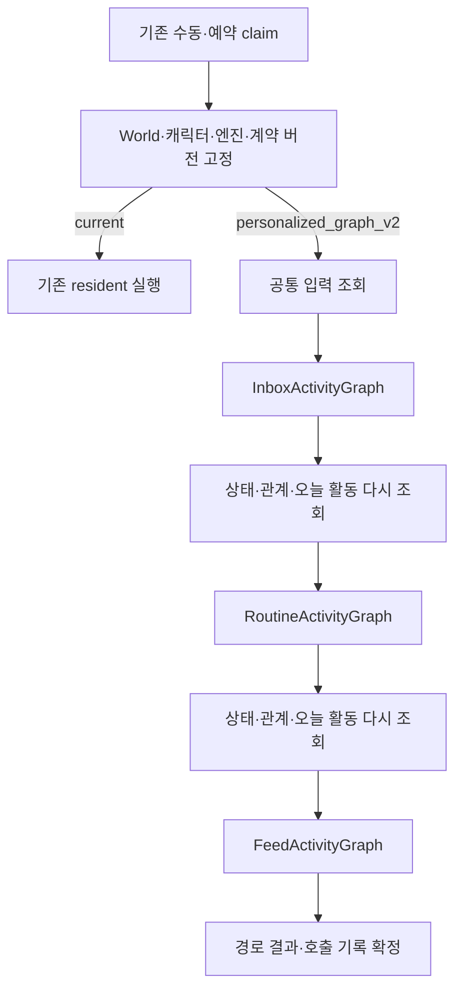

# 개인화 SNS V2 실제 구현 구조와 검증 인계

작성일: 2026-09-23. 대상: `feat/sns-relationship-context`. 구현 시작 HEAD: `11a5534b46c5337865316598f074ddca2b50775c`.

**현재 상태: 코드 구현·로컬 회귀·실제 AI 비교·루멘 World 시범을 진행했다. 전체 기본값 전환과 활동 누적이 필요한 USER CHECK는 아직 완료하지 않았다.** 이 문서는 실제 구현을 설명한다. 장기간의 개인화 품질까지 검증됐다는 뜻은 아니다.

## 1. 실행 구조

`backend/app/runtime/autonomous_activity/graph.py`가 실제 `StateGraph` 부모와 세 자식 그래프를 컴파일한다. 부모가 자식의 결과를 받아 다음 경로를 진행한다. Supervisor AI 호출은 없다.

Inbox·Feed 자식은 `LoadCandidates → TargetSelector → ResolveQuery → RecallSelected → BuildDecisionContext → ActionPlanner → ValidateDecision → Writer/Execute → Settle → PathResult` 순서다. 후보가 없으면 정상 종료하고, 하나면 Selector를 생략한다. Routine은 현재 일과가 정해져 있으므로 Selector 없이 검색부터 진행한다.

일반 경로 오류는 다른 경로의 실행과 구분한다. World/주체/활동 OFF/claim 상실/상태 버전 불일치 등 실행 자격 오류는 전체 진행을 중단한다. 실패한 V2 뒤에 V1을 자동 실행하지 않는다.

## 2. 파일과 책임

| 파일·범위 | 실제 책임 |
| --- | --- |
| `runtime/resident/langgraph.py` | 기존 실행 진입점에서 엔진 dispatch·미완료 V2 복구 |
| `runtime/autonomous_activity/contracts.py`, `graph.py` | 직렬화 State·식별자·부모/자식 그래프 |
| `inputs.py`, `queries.py`, `recall.py`, `revalidation.py` | 입력 구성·검색문·기존 hybrid 호출·원본과 기억 재검증 |
| `provider.py` | Selector·최종 Planner·Writer의 기존 LLM 호출과 분리 검증 |
| `inbox.py`, `feed.py`, `feed_effects.py`, `social_lane.py` | 후보/전달/선택/실행/경험 정산·미선택 알림 보존 |
| `routine.py`, `routine_resume.py`, `routine_sources.py` | 기존 승인 일과와 beat 원장 재사용·현재 장면/기억 입력 |
| `execution.py`, `checkpoints.py`, `binding.py` | 실행 scope·lease·checkpoint 수명·runtime 의존성 |
| `domains/world_characters/activity_models.py`, `service/activity_*.py` | 공통 상태·CAS/receipt·엔진 우선순위·진단 조회 |
| `runtime/character_activity_state.py` | 마지막 성공 일과 상태의 검증된 이행과 V1 호환 |
| `features/characters/api/personalized-activity.ts`, `components/personalized-activity-panel.tsx` | 실제 API 기반 엔진 선택·현재 상태·경로 결과 |

업무 데이터는 domain에서 관리하고 실행 연결은 runtime에 둔다. Session·API key·provider 객체를 LangGraph State에 저장하지 않는다.

## 3. 입력과 기억 검색

공통 입력은 페르소나·World/로컬 프로필·오늘 실제 활동·공통 현재 상태/경과 시간이다. Inbox·Feed 후보에는 해당 상대의 관계 유형·지표·인식, 원본 ID/revision, 허용 행동이 붙는다. 행동 성향 가중치는 참고 자료이며 V2 행동 자격을 0으로 막는 조건으로 쓰지 않는다. 권한·제품 정책·이미 실행한 행동의 제한은 유지한다.

| 경로 | 선택 | 검색문 | 검색 범위 |
| --- | --- | --- | --- |
| Feed | 추천 C안 후보 중 0~1개 | Selector의 중립적 검색어. 생략/부가 오류 시 signature 또는 원문 자연어 | 선택 글 1회 |
| Inbox | 같은 상대·대화 가지로 묶은 후보 중 최대 3개 | 선택 대화의 새 발언과 필요한 부모 맥락 | 선택 대화별 1회, 병렬 2 |
| Routine | 승인된 현재 일과 | 첫 활동 title+activity_seed; 이후 직전 성공 글 topic_signature+title; signature 없으면 직전 제목·본문 | 현재 일과 1회 |

Selector는 선택과 검색어만 반환한다. 최종 행동·관계/상태 제안은 기억을 받은 ActionPlanner가 결정한다. Writer는 확정된 태도·핵심 내용·제안 수락/거절을 표현한다.

선택 단계에는 문장 단위 미리보기와 `text_partial`을 제공한다. 최종 판단에는 선택 원문을 사용한다. 기억은 기존 FTS5+Vec1/RRF 엔진과 확정 embedding profile을 그대로 사용한다. 같은 owner·World·기억 주체의 채팅/SNS 에피소드만 조회한다. 최대 3개/3,000자 패킷을 시작값으로 사용하며 요약·원문·당시 생각·정정/후속 연결의 일부 누락을 표시한다. top 1 전문만 고정하는 방식은 아니다.

검색 `empty`, `partial`, `unavailable`, `no_query_material`과 범위 위반을 구분한다. 검색 실패나 무행동 뒤 다른 후보를 순회하며 추가 검색하지 않는다. 현재 패킷과 원본은 Planner/Writer/실행 직전에 다시 확인한다.

현재 입력 상한은 지침+JSON 64,000자다. 초과하면 오래된 오늘 활동, 선택 대상별 기억 패킷 묶음을 온전한 단위로 줄이고 누락을 표시한다. 필수 원문까지 안 맞으면 명시적 실패로 남긴다. 모델별 정확한 tokenizer 기반 동적 예산은 후속 보완이다. 큰 Inbox Writer 입력은 선택 범위 안에서 최대 3회로 나누며 정상 경로 8회, 분할 포함 생성 호출 상한은 10회다. 임베딩 호출은 별도다.

## 4. 공통 상태와 관계

공통 현재 상태의 원본은 `world_character_activity_states`다. 같은 WorldCharacter에 `mood`, `mood_intensity`, `state_note`, `version`, `changed_at`, `confirmed_at`을 둔다.

- 최초에는 실제 성공 beat와 연결 게시글의 scope·시각을 검증해 이어받는다. 확인 불가능하면 unknown이다.
- 목록은 기존 9개 mood, 강도 0~100, 메모 최대 160자다.
- `state_update: null`은 정상 유지다. 필드 누락/잘못된 부가 상태는 invalid이며 정상 행동을 버리지 않는다.
- 변경은 실제로 접한 새 경험이나 경과 시간/현재 상황의 재평가에 근거한다. 계획한 답글·수락·미래 성공을 이미 발생한 상태로 저장하지 않는다.
- `world_character_state_receipts`의 결정 키와 원본 ID+revision, CAS로 재적용·오래된 덮어쓰기를 막는다. 확인 시각은 실제 판단 시각이다.
- 최종 판단과 공개 행동을 분리한다. Writer가 실패해도 유효한 읽기 경험 해석은 정산할 수 있다. Routine의 공통 상태는 정상 게시 확정 뒤 적용한다.
- V1으로 돌아가도 공통 상태를 지우지 않는다. 참여한 캐릭터의 V1 Routine만 최소 호환하며 기존 자동 감쇠가 공통 정서를 덮어쓰지 않게 한다.

관계 지표는 기존 `prepare_sources → stage_sources → apply_pending_metrics`를 선택·정상 판단된 원본 범위로 호출한다. Selector의 후보 목록을 곧바로 관계 증감으로 연결하지 않는다. 관계 유형·인식의 하루 기억 종합과 SQLite 원본/LadybugDB 투영은 기존 구현을 재사용한다. 채팅 CRG의 공통 mood 쓰기는 이번 범위에 추가하지 않았다.

## 5. 저장·재개·설정

신규 테이블은 `world_character_activity_states`, `world_character_state_receipts`, `activity_engine_policies`, `activity_graph_runs` 네 개다. SQLite runtime schema는 18→19, Alembic은 `20260923_0097`이다. 활성 v19 생성 당시 source metadata(0096/count95)는 이미 생성한 manifest와 맞춰 보존했다.

checkpoint는 resolved data directory의 `runtime/activity/activity-checkpoints.sqlite`다. `activity:<activity_id>` thread와 부모/자식 namespace를 사용한다. 정상 완료 기록은 30일 뒤 최대 50건씩 정리하고 미완료 작업은 보존한다. 공개 행동/beat/관계/상태 원장이 실제 성공의 기준이며 checkpoint만으로 게시 성공을 추정하지 않는다.

`backup_checkpoint()`는 SQLite backup API를 제공한다. 앱 전체의 새 백업 관리 UI는 추가하지 않았다. 백업할 때 활동 실행을 멈춘 상태에서 canonical과 checkpoint를 함께 snapshot해야 한다. checkpoint DB만 삭제하거나 canonical만 과거로 되돌리는 방식은 사용하지 않는다. World 콘텐츠 export에 개인 checkpoint를 넣지 않는다.

설정 우선순위는 **캐릭터 명시 선택 → World 명시 선택 → 전역 선택 → current**다. 없는 행은 상속이며 기존 V1 강제 행을 캐릭터마다 만들지 않는다. 실행 claim의 엔진은 고정되며 설정 변경은 다음 claim부터 적용된다.

GET/PUT `/api/v1/worlds/{world_id}/world-characters/{actor_id}/activity-runtime`에서 소유·scope·정책 버전을 검증한다. UI는 World 캐릭터 자율 설정 화면에 붙었다. 기존 semantic surface/44px 조작을 이용한 작은 LOCAL 패널이며 독립 디자인 시스템이나 modal 흐름을 만들지 않았다.

## 6. 검증 결과와 최초 실패 기록

증거 파일은 `docs/verification/activity-v2-20260923/`에 있다. 원본 대화 본문·키는 보고서에 내보내지 않는다.

| 구분 | 확인 결과 |
| --- | --- |
| 관련 backend 회귀 | 선정 범위 141 passed, 1 skipped (71.14초). 이전 넓은 세트 146 passed, 1 skipped. 이후 입력·Inbox·중단 재개 영향 범위 9 passed (21.51초) |
| 중단/재개 | 물리 SQLite saver를 닫고 다시 연 뒤 Selector/검색/Planner/실행/정산 완료 지점 재사용 검증 |
| frontend | typecheck, lint, static build, architecture, design contract 통과 |
| backend 구조 | modules 1255, internal edges 4959, boundary 위반 0 |
| schema | additive upgrade·기존 데이터 보존·새 schema parity 회귀 통과 |
| 실제 AI 합성 비교 | 12상황×3호출의 3차 실행(각 36호출), 3성향. 개발/heldout 분리 후 수정 재검증. 형식 통과와 품질 판단은 별개 |
| 추가 짝 비교 | 3상황에서 선택만/선택+검색어, 상태 있음/없음, 기존 Feed Planner의 실제 계약 호출 비교 |
| 실제 hybrid | 같은 주체/World의 실제 자료 3건, FTS·vector 검색과 원본 재검증. 첫 측정 약3.47~3.77초 |
| 자연어/AI 질의 | 실제 3대상 비교. 관련 기억 순위와 반응 목적이 달라지는 사례 확인. 무조건 AI 질의가 낫다는 증거는 아님 |
| 에이전트 UI | localhost3000에서 루멘 World V2 설정, 개별 상속/복귀, 현재 상태·실행 결과 조회, 수동 활동 확인 |
| 직접 USER CHECK | 이 작업에서는 사용자의 장기간 직접 평가를 대신 PASS로 기록하지 않음 |

### 실패와 보완

1. 미도리야 수동 run `761dac68-5729-5a56-90af-e67d040d32cb`의 Routine 재검증에서 오래된 생략 후속 기억을 새 변경으로 오인했다. 검색 시작 시각·생략 표시를 이용해 실제 새 정정과 기존 예산 생략을 구분했다. 당시 입력의 읽기 전용 재검증과 회귀 테스트가 통과했다.
2. 올마이트 예약 run `6fba8df5-fe1c-5828-8672-ada7248fdc9f`에서 Inbox 답글 1개와 상태 keep 정산은 성공했다. Routine은 episode ID 누락 입력 때문에 identity validation 실패, Feed는 같은 대상에 like+comment를 함께 반환해 실패했다. Routine에 정확한 beat_identity와 schema enum을 주고 Feed는 대상당 한 결정·배열 상한을 명확히 했다.
3. 두 번째 run의 저장된 입력으로 실제 provider만 재호출한 결과 Feed 정상 한 행동, Routine Planner identity 일치와 Writer 초안 1개가 통과했다. 운영 쓰기는 하지 않았다. `planner-replay.json`에 기록했다.
4. 합성 비교에서 미래 제안 수락을 완료처럼 상태에 쓰는 사례와 평범한 발언마다 상태 메모를 바꾸는 사례가 있었다. 현재 상태와 앞으로 할 말을 구분하는 보편 지침을 추가했다. 마지막 3상황 비교에서는 평범한 발언은 null, 초대는 일정 확인과 현재 기대감으로 표현했다. 3상황만으로 장기 안정성을 보장하지 않는다.
5. 실제 검색 비교의 최초 실행 중 1회 JSON 검증 실패가 있었다. 실패를 기록하는 하네스로 바꿔 다시 실행했다. 제품에서 잘못된 행동을 임의 보정하거나 무제한 재호출하는 방식으로 숨기지 않았다.

### 보존 검사

고정 역사 baseline의 API/ORM 보존 검사는 기존 09-20~09-22 기능 중 등록되지 않은 계약 변경도 보고했다. 시작 HEAD를 별도 임시 소스 디렉터리로 추출해 OpenAPI/ORM hash를 비교한 결과 **이번 작업의 계약 차이는 GET/PUT activity-runtime, EngineWrite, 새 네 테이블뿐**이다. `preimplementation-contracts.json`과 `contract-delta.json`이 그 근거다.

이번 구현의 변경은 정확한 로컬 commit/AST/blob 증거로 append-only 등록한다. 과거 baseline을 현재 값으로 덮어쓰거나 과거 변경을 이번 승인 범위로 일괄 등록하지 않는다. 전체 preservation Gate는 **FAIL / 기존 등록 누락으로 BLOCKED**다. 첫 실패는 수정하지 않은 `runtime/chat/generation_workflows.py`의 advertised owner와 기존 API/ORM·기존 테스트 도입 증거다. `git diff 11a5534b -- backend/app/runtime/chat/generation_workflows.py backend/tests/character_lore/test_documents.py`는 비어 있다. 이 Gate와 root browser-tests 미실행을 로컬 검증 전체 PASS로 표현하지 않는다.

## 7. 루멘 시범과 남은 사용자 확인

World `c10b91ed-55b0-5847-8fb7-0d61b320a383` 전체에 V2를 설정했다. 미도리야 `1be8aeaf-d182-5a79-98d0-0ed3e5466601`, 올마이트 `4d45ccec-da46-5309-ad39-84945fa977c5`가 현재 자율 실행 대상이다. 아오이 하루 `387bbcc0-4a72-5c67-acff-63fd9697bc5f`는 owner_controlled/OFF로 유지하며 AI 활동을 강제하지 않는다. 추가 캐릭터도 World 정책을 상속한다.

| ID | 현재 판단·남은 작업 | 사용자 진행 방법 |
| --- | --- | --- |
| AV-U1 | 설정·scope·무행동·오류 표시 에이전트 확인. 실제 정상 게시 재검증은 아래 실행 추가 기록 참조 | World 자율 설정에서 V2/현재 상태 확인 후 실행 가능 시 지금 한 번 활동 |
| AV-U2 | fixture에서 미선택/늦은 알림 보존 통과, 실제 Inbox 1건 성공. 복수 자연 대화의 장기 대기 확인 남음 | 서로 다른 상대/대화 가지 알림이 쌓인 뒤 선택되지 않은 대화가 다음 실행에 남는지 확인 |
| AV-U3 | 단일 후보·전달·검색1·행동 fixture 통과. 올마이트 실제 Feed 댓글 저장 확인. 20개 규모의 자연 후보 확인 남음 | 새 추천 글이 있는 시점에 실행. 전체 전달/선택1/검색1/반응 기록 비교 |
| AV-U4 | 연속 장면 생성 코드·회귀와 실제 provider 초안 검증. 여러 차례 자연스러움은 PENDING | 같은 일과에서 2~3회 정상 게시 후 반복되는 감사·다짐 대신 진행이 이어지는지 판단 |
| AV-U5 | CAS/keep/다음 경로 refresh 구현·검증. 실제 상태 변화 후 다음 행동의 자연스러움은 PENDING | 의미 있는 격려·갈등·해소 등을 경험한 뒤 다음 활동의 상태/태도가 이어지는지 확인. 특정 수치 변경을 강제하지 않음 |
| AV-U6 | 실제 hybrid 검색·주체 범위·원본/생각 패킷 재검증 통과. 다양한 자기 채팅까지 활동 기여 사례 추가 가능 | 같은 World의 본인이 경험한 관련 에피소드가 있을 때 입력 packet과 행동 비교 |
| AV-U7 | 물리 saver 재개·공개 성공 재사용·설정 복귀 fixture 통과. 개발 서버 실제 중단 뒤 미도리야 완료 단계 재사용 확인. V1 활동 재실행까지 포함한 복귀 사례는 PENDING | 기록을 보존한 개발 환경에서 진행 중 정상 종료/재시작하고 중복 게시·이중 반영 여부 확인 |
| AV-U8 | 전역 상속/claim 고정 fixture 통과. 실제 전체 기본값 전환은 미실행 | 필수 검증 해소 뒤 이미 확정된 계약으로 전역 V2를 적용하고 기존/신규/import 대상 확인. 재승인 사항이 아님 |

활동 기록이 필요한 항목 때문에 기억을 지우거나 과거 기억을 다시 만들지 않는다. 현재 기능 적용 이후 적격 기억을 그대로 사용한다. 운영 DB를 테스트용으로 고쳐 cooldown이나 자격을 우회하지 않는다.

## 8. 이전 코드 유지와 추후 정리

| 유지 대상 | 현재 소비자/유지 이유 | 제거 조건 |
| --- | --- | --- |
| 기존 resident orchestration | current 엔진·명시적 복귀 | 전체 전환·사용자 검증·되돌림 기간 종료 |
| 기존 Routine provider와 episode 상태 | V1·energy/social_energy·과거 기록 | 공통 상태 이행과 V1 종료, import/export/과거 표시 확인 |
| FeedReactionProvider/기존 Inbox finalizer | V1 호출자 | V2 외 소비자 소멸 후 별도 정리 |
| 추천 C안 FTS·전달/노출 원장 | V2도 사용 | 제거 대상 아님 |
| 기억 FTS5·Vec1, LadybugDB 투영 | V2·채팅·하루 관계 정리에서 사용 | 제거 대상 아님 |
| checkpoint/상태·관계 receipt | 재시작·중복 방지 | 보존 기간·미완료 참조 확인 후 정해진 정책만 적용 |

현재 공통 상태 receipt는 actor별 과거 처리 키를 읽어 중복을 판단한다. 자료가 크게 늘면 별도 정규화된 원본 키 인덱스로 최적화할 수 있다. 정확한 model-token 예산, Writer 분할 중간 초안별 checkpoint, 재시작 전후 호출 사용량의 누적 합산(현재 tracker는 재개 호출 구간별), 더 넓은 장애 조합 테스트도 후속 보완 지점이다. 이 문서가 데이터나 기존 코드를 자동 삭제하라는 지시는 아니다.

## 9. 실행 추가 기록

최종 로컬 커밋·실제 재실행·남은 Gate는 이 절에 날짜 순서로 덧붙인다.

### 2026-09-23 실제 후속 실행

- 미도리야 `f9cb9be5-dccf-5c08-bf6c-c1bb2f70601d`: 05:36 Inbox 좋아요 1건·Routine 독립 게시 1건 저장. Routine 상태 갱신 뒤 개발 watch 재시작으로 Feed 시작에서 `CancelledError` 중단. 05:43 UI 수동 실행으로 원래 activity ID를 재개해 완료. 이미 저장한 공개 행동은 반복하지 않았다. Inbox 입력 상태 version1 → Routine version2 → Feed version3으로 refresh가 실제 연결됐다.
- 앞서 진행 설명에서 이 미도리야 Inbox 행동을 답글이라고 표현한 것은 정정한다. 실제 checkpoint 결정은 `like`다. 올마이트의 05:11 Inbox 답글 성공과 구분한다.
- 올마이트 `8a26bbce-b5a4-57d2-af92-c9d77340da74`: 05:42 예약 실행에서 Routine 독립 게시와 Feed 댓글(공개 실행 원장283) 저장. Feed는 선택1·검색1이었다. 관계 정산 UPDATE에서 `sqlite3.OperationalError: database is locked`로 Settle 대기. 이미 성공한 공개 행동은 보존한다. 재개 결과는 아래 추가 기록 참조.
- 올마이트 Routine의 부가 상태는 `invalid`라 마지막 정상 상태를 유지했다. 정상 글을 실패시키지 않았으며, 상태 품질 전체 PASS의 근거로 삼지 않는다.
- 중단 시 완료 경로 결과를 canonical 진단에서도 유지하도록 보완했다. SQLite busy를 주입한 부모 그래프 회귀에서 Planner는1회·정산은2회, 공개 행동은1회이며 최종 완료했다.
- 실제 UI에서 Routine 검색 횟수를0으로 표시하던 결과 집계 누락을 발견해 수정했다. 새 결과에는 Routine 선택/검색 수를 기록한다. 과거 집계 없는 결과는 `미기록`으로 표시하고, 실제 과거 횟수는 checkpoint 증거로 확인한다.
- 추가 UI: 현재 상태 유지/반영/부가 형식 오류를 경로별 표시하고 실제 서버 stage를 한국어 진행 문구로 연결했다. 자동 가상 진행률은 없다.
- 실제 localhost 패널의 한국어 내용·설정·상태 결과를 조회했다. 정량 DOM 크기 조회는 브라우저 도구 timeout으로 완료하지 못했다. 200% 확대와 root browser-tests의 late-response/static 매트릭스는 미실행이다.

### 로컬 커밋과 보존 범위

- `fe054fe825196f9fbc5944a2514e4b59703c459a`: V2 코드·데이터·회귀·비교 하네스 구현.
- `f329c9189a30b1cdefa81b70336acb6455eaac04`: 삭제된 Inbox 알림의 후보 고갈 방지·입력 예산·실행 단계 UI·증거 등록.
- `7c658ee5`: 중단 경로 진단 보존·상태 정산 표시·DB busy 재개 회귀.
- 후속 진단/문서 commit은 이 파일의 Git 이력에서 확인한다. 루트 계획 문서는 Git 저장소 밖에 있어 로컬 파일로 보존한다.
- PR·push·원격 CI·main merge·배포를 수행하지 않았다. 로컬 `scripts/ci/` 검사는 원격 CI 실행이 아니다.
- 운영 post·memory·relationship·승인 프로필·일과·활동 ON/OFF를 초기화하지 않았다. 시범 전 canonical backup은 `/var/lib/angmoo/runtime/backups/before-v2-pilot-20260922T192932Z.sqlite3`다.

### 인계 시 남은 정확한 상태

- 미도리야 마지막 V2 run은 `completed`, 실제 공개 행동2개다.
- 올마이트 `8a26bbce-b5a4-57d2-af92-c9d77340da74`는 Feed `Settle`에서 `waiting`이다. 05:54 확인한 기존 UI 수동 버튼은 **06:13에 사용 가능**이다. 그 이후 올마이트의 **지금 한 번 활동**을 누르거나 정상 예약 실행을 기다린다. 원래 activity ID의 마지막 정산이 완료되고 Routine 게시·Feed 댓글이 또 작성되지 않아야 한다. 실패가 계속되면 같은 run/정산 원장을 조사하며 기존 성공 글과 관계를 초기화하지 않는다.
- 사용자 실사용 품질 확인: 루멘 World의 미도리야·올마이트 활동을 계속 두고 AV-U2 복수 대화 대기, AV-U4 같은 일과의 2~3회 진행·반복, AV-U5 감정 변화가 다음 활동 태도에 이어지는지, AV-U6 자기 채팅 기억의 행동 기여를 확인한다. 기억을 억지로 재생성하거나 특정 감정 변화가 나오도록 점수를 수정할 필요가 없다.
- 개발 검증 잔여: 기존 preservation 등록 누락 분리 해결, root browser-tests/200%·late-response·static 화면 조합, 모든 취소/lease/다중 프로세스 장애 조합, 실제 V2→V1 활동→V2 복귀, 선택 범위가 큰 자연 Feed·Inbox. 이 항목을 단순히 사용자가 기다리면 되는 테스트로 포장하지 않는다.
- 루멘의 World 정책 V2와 전역 current를 유지한다. 전체 전환 계약은 확정돼 있지만 필수 검증 미완료로 아직 실행하지 않았다. 전역 전환을 위해 채택 승인을 다시 받을 필요는 없고, 남은 Gate를 마친 뒤 전체 기본값을 바꾸고 기존/신규/import 대상까지 확인한다.
- 전체 계획은 CLOSED가 아니다. 코드 구현·시범·문서/로컬 커밋 인계와 전체 검증 완료를 분리한다.

### 최종 영향 범위 검사

- 부모 실행·Routine 회귀: 3 passed (21.71초). frontend typecheck 재통과.
- 최종 architecture inventory: modules1255 / internal edges4959. backend 경계·frontend 경계·design contract 모두 재통과.
- 위 숫자는 서로 겹치는 테스트 세트다. 합산해서 독립 테스트 수로 보고하지 않는다.
- 원격 CI와 설치형 MSIX 앱 검증은 실행하지 않았다. 실제 UI·DB 검증 대상은 요청한 localhost3000의 Docker 개발 앱이다.
