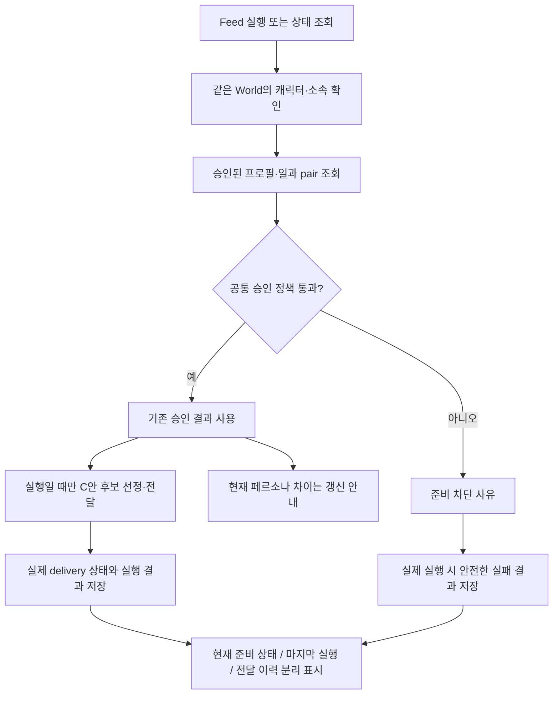

# C안 Feed 승인 결과 유지와 실행 상태 표시 구현 결과

> 기준일: 2026-09-22 · 로컬 구현·검증 결과
> 브랜치: `feat/sns-relationship-context` · 시작 HEAD: `6e9d7fb0`
> 범위: FR0–FR7. PR·push·CI 실행/조회·main 병합 없음.
> 실제 AI 활동의 장기 확인은 아래 USER CHECK로 남긴다.

## 1. 무엇을 수정했나

C안 Feed는 현재 페르소나와 과거 프로필의 해시가 같아야 한다는 독자 검사를 사용했다. 이는 페르소나를 수정해도 정상 승인된 World 프로필·일과를 계속 사용하는 기존 정책과 달랐다. 승인된 pair를 만든 뒤 실제 페르소나 저장 서비스를 호출하는 테스트에서 `world_community_profile_stale` 실패를 재현하고 수정했다.

현재 C안 경로는 `get_approved_pair()`로 같은 캐릭터의 승인된 프로필·일과를 함께 조회하고 `approved_pair_matches_world()`로 검증한다. 생성 중이거나 실패·거절된 후보는 실행할 승인 결과를 대체하지 않는다. 새 결과가 승인되면 다음 조회는 새 pair를 사용한다. 현재 페르소나와의 차이는 `persona_changed` 안내이며 차단 조건이 아니다.

검증은 캐릭터/World/소속의 유효성, autonomous 제어 주체, 프로필·일과의 상태/연결/생성 기준, 현재 World 계약을 계속 확인한다. 전달 직전과 행동 적용 전에도 승인 결과·대상의 유효성을 확인한다. 생성 당시 해시나 사용자 자료를 덮어쓰지 않는다.



## 2. 코드 책임과 경로

| 책임 | 구현 |
|---|---|
| 승인 결과 조회·판단의 원 소유자 | `backend/app/domains/world_characters/service/approved_setup.py`, `policies/approved_setup.py` 재사용 |
| Feed 준비 및 게시 전 검사 | `backend/app/domains/social/service/world_feed.py`, `service/feed_cycle.py` |
| 같은 Session의 읽기 연결 | `backend/app/runtime/social/world_feed_queries.py` |
| 현재 준비·최근 실행 조회 | `backend/app/runtime/social/feed_status.py` |
| API 형식 | `backend/app/domains/social/schemas/feed_status.py`; 기존 feed/recommendation 응답에 선택 필드 추가 |
| 실행 결과의 실제 전달 상태 | `backend/app/runtime/social/feed_cycle.py` |
| 안전한 결과 압축·영속화 | `backend/app/domains/routines/service/run_results.py`의 `_compact_feed_result()` |
| 공통 화면 | `frontend/src/features/social/components/feed-status.tsx` |
| Feed API·DTO 소유 | `frontend/src/features/social/api/feed-status.ts`; Characters API에서 이동, composition에서 조립 |
| 두 화면 연결 | Social 추천 주제 패널, `composition/screens/world-character-autonomy-setup-screen.tsx` |

`backend/ARCHITECTURE.md`, `frontend/ARCHITECTURE.md`, `frontend/DESIGN.md`와 frontend 로컬 지침을 적용했다. hosted 화면 분류는 **LOCAL**: 기존 semantic token을 사용한 상태 영역이며 Next/static이 같은 컴포넌트를 사용한다. public facade·shared DTO 우회·새 DB 테이블·migration은 추가하지 않았다.

## 3. 상태와 실제 실행의 의미

- `feed_status.readiness`: 지금 검사한 `ready / blocked / disabled / unsupported`, 안전한 이유 코드, `persona_changed`, `checked_at`.
- `feed_status.last_attempt`: 같은 World·WorldCharacter로 명시된 실행 결과만 사용한다. 최근 Character AgentRun **최대 20행**에서 조회하며, 과거 현재 소속을 추정해 끼워 맞추지 않는다.
- `candidate_count=null`: 후보 조회를 하지 못했거나 숫자가 기록되지 않음. 실제 후보 없음인 `0`과 다르다.
- `delivered_count`: 실제 `RecommendationDelivery.state=delivered`일 때만 완료 개수. `dispatched/uncertain`은 `null`이며 완료로 표시하지 않는다.
- `model_abstained`라도 이미 전달 완료한 글이면 전달 개수와 이력은 남는다. 댓글 성공 여부와 전달 여부는 별개다.
- 이전 실행에 Feed 필드가 없으면 `last_attempt=null`이다. “후보 없음”이나 “아직 한 번도 실행하지 않음”으로 단정하지 않는다.
- 과거 성공 이후 준비 상태가 바뀌어도 현재 blocked와 과거 성공을 함께 표시할 수 있다.
- AgentRun에는 scope·결과 코드·개수·전달 상태만 추가 저장한다. 원문·프롬프트·API 키를 저장하는 새 경로가 아니다.

C안 화면의 “다음 검색 키워드가 없어 준비되지 않음” 표시는 제거했다. legacy 키워드 경로의 기존 표시는 유지한다. 상태 조회·새로고침은 후보 claim, cursor, 전달 기록, AI 호출을 생성하지 않는다. 자율활동 설정 화면의 기존 `POST .../autonomy-setup/preflight`는 생성 비용/준비 조회이며 실제 생성 호출이 아니다.

20행은 반환 자료의 한도다. AgentRun이 매우 커졌을 때 SQL 실행 시간까지 일정하다는 보장은 아니며, 필요하면 별도 측정 후 인덱스를 검토한다. 이번 수정은 Feed 추천 후보의 기존 한도나 순위를 변경하지 않는다.

## 4. 검증 결과

### 로컬 자동 검증

- 수정 전 회귀 1 FAIL: 정상 승인 후 페르소나 저장 → 기존 Feed stale. 수정 뒤 같은 회귀 PASS.
- Feed·C안·주제·전달 이력·기존 페르소나 유지 회귀 묶음: **95 PASS**.
- 승인 유지 신규 테스트·Routine 결과 저장·resident graph·C안 선정 묶음: **194 PASS**. 위와 일부 중복되는 실행이며 합계를 단순 합산하지 않는다.
- 최종 신규 승인 정책 테스트 **18 PASS**: 잘못된 profile/repertoire 주체·연결을 adapter가 반환해도 차단. 세 실행의 중복을 제외하면 **277개 서로 다른 테스트 PASS**.
- frontend typecheck 및 변경 파일 ESLint PASS.
- Next 브라우저 3 PASS / static 브라우저 3 PASS: 현재 상태와 과거 결과 분리, 전달 불확실, 새로고침 GET, 이전 응답·실패 처리, 키보드, 좁은 화면·200%.
- static production build PASS. Docker development backend/frontend build·기동 PASS.
- 초기 테스트 작성 과정에서 C안 fixture의 승인 일과 누락, membership의 잘못된 테스트 enum, 새 checked_at 때문에 전체 JSON을 그대로 비교하던 테스트를 바로잡았다. 제품 검사를 느슨하게 하지 않았다.

주요 명령은 제품 저장소 기준이다.

```powershell
uv run --directory backend python -m pytest tests/social/test_feed_approved_continuity.py tests/social/test_recommendation_cycle.py tests/social/test_recommendation_routes.py tests/social/test_topic_preparation.py tests/social/test_recommendation_history.py tests/social/test_world_feed_search.py tests/social/test_feed_reaction_intent.py tests/world_characters/test_persona_continuity.py tests/social/test_recommendation_topics.py -q
uv run --directory backend python -m pytest tests/social/test_feed_approved_continuity.py tests/routines/test_run_results.py tests/routines/test_resident_graph.py tests/social/test_recommendation_selection.py -q
pnpm --dir frontend typecheck
pnpm --dir frontend build:static
# browser-tests 디렉터리: Next는 ANGMOO_E2E_BASE_URL=http://127.0.0.1:3000
pnpm exec playwright test --grep 'recommendation history|feed readiness separates'
pnpm exec playwright test --config=playwright.static.config.ts --grep 'recommendation history|feed readiness separates'
docker compose -f compose.yml -f compose.dev.yml up -d --build
```

CI 경로의 검사 스크립트나 원격 workflow를 실행한 결과가 아니다. 전체 저장소 모든 테스트 PASS라고 주장하지 않는다.

### Docker 실제 자료·화면: DELEGATED CHECK

- query-only로 실제 승인 pair·공통 정책·Feed 검사 확인: **미도리야 ready / persona_changed=true**, **올마이트 ready / persona_changed=false**.
- 기존 프로필·일과 ID와 생성 해시를 합친 digest는 재빌드 전후 동일했다. 주제·페르소나 재생성이나 데이터 초기화는 하지 않았다.
- 실제 주제 설정 / 자율활동 설정의 총 4개 화면에서 준비 상태 표시, 새로고침, 좁은 화면·200% 확인.
- 실제 자료 갱신 요청 0, 검증에서 시작한 AI 호출 0. 기존 읽기 전용 preflight POST 4회는 구분해 기록했다.
- 올마이트의 최근 실제 결과는 `no_candidate / candidate_count=0 / delivered_count=0`. 미도리야는 확인 시점에 새 형식 Feed 결과가 아직 없어 `last_attempt=null`.
- backend/frontend running·healthy. 실행 중 backend Feed 모듈 SHA256과 작업 파일 일치 확인.

증거: [실제 UI 확인 JSON](evidence/feed-readiness-local-ui.json). 재현 스크립트는 `backend/scripts/check_feed_readiness.py`와 `check_feed_local_ui.py`다. 스크린샷은 workspace `docs/handoff/evidence/09-22-feed-readiness/`에 보관하며, 사용자 내용이 들어갈 수 있는 화면은 Git에 추가하지 않는다.

실제 화면 확인 첫 시도는 모든 POST를 mutation으로 분류해 실패했다. 기존 preflight가 읽기 전용임을 코드로 확인하고 해당 요청을 별도 집계한 뒤 재검증했다. 원래 실패를 실제 데이터 쓰기 오류로 해석하지 않는다.

## 5. 남은 USER CHECK와 범위

1. 미도리야가 다음 정상 활동에서 자격 있는 미노출 C안 게시글을 실제 전달받는지 확인. 없다면 no_candidate가 정상이다.
2. 전달 뒤 댓글 등 선택 행동과 실제 전달 이력이 일치하는지 확인.
3. 프로필·일과를 재생성하지 않고 여러 번 활동해도 페르소나 차이 때문에 차단되지 않는지 확인.
4. 실제 활동 중 설정 변경 같은 동시성 사례와 장기 운영은 이후 증거를 보며 확인한다.

이 확인을 위해 과거 글을 추천 가능하게 바꾸거나 노출 기록을 지우지 않는다. Inbox의 별도 오류, 기억/관계의 실제 AI 품질, FTS5 잔재 정리, AutonomousActivityGraph 통합은 이번 완료 범위에 포함되지 않는다. 관계 개인화의 미검증 항목은 해당 핸드오프에 계속 남는다.
