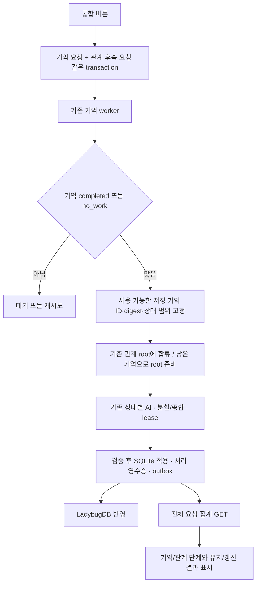

# 수동 기억·관계 정리 통합 실행 — 구현과 검증

> 기준일: 2026-09-22 / MC0–MC10 로컬 구현·검증·인계 완료
> 브랜치: `feat/sns-relationship-context` / 시작 HEAD: `65c97262cb384093f1c0bde2c801a9129b385087`
> 실제 Docker/AI 확인은 에이전트에게 위임한 검증이다. 인간의 관계 품질 USER CHECK와 구분한다.

## 1. 사용 방법과 결과 의미

Memory 화면에서 자율 캐릭터를 선택하고 **지금 기억·관계 정리**를 누른다. 저장된 기억 AI 동의·모델·키를 사용한다.

| 상태 | 처리 |
|---|---|
| 미처리 활동 있음 | 기존 기억 정리 후 관계 정리 |
| 활동 없음, 자격 있는 미처리 기억 있음 | 기억 AI 없이 관계 정리 |
| 둘 다 없음 | 새로 정리할 내용이 없습니다. AI 호출 없음 |
| 이미 진행 중 | 같은 논리 요청의 진행 조회 |
| 기억 실패/중단 | 관계 단계 대기, 남은 기억 작업부터 재시도 |
| 일부 관계 실패 | 정상 기억·완료 상대·부분 결과 보존, 남은 작업 재개 |
| 관계 판단 `keep` | 정상 검토 완료. 문구가 변경되지 않아도 성공 |
| 사용자 조작 캐릭터 | 기억만 정리. 사용자의 주관적 관계를 대신 판단하지 않음 |

자동 예약 OFF나 예약 시각 전에도 수동으로 접수할 수 있다. 기억/AI 비활성, 동의·키·범위 검증을 생략하지 않는다. 자동 예약과 활성화/전환 기준을 바꾸지 않는다. API backoff 중에는 재시도 버튼을 눌러도 대기 시각을 앞당기지 않는다.

요청 완료 뒤 새 활동으로 `정리 대기`가 다시 생기는 것은 별개의 다음 처리 대상이다. 화면의 완료 건수는 완료된 요청 범위이며 현재 대기 개수 전체를 뜻하지 않는다.

## 2. 실제 흐름과 책임



- Memory 도메인은 원래의 요청·scope·기억 처리 의미를 유지한다.
- `MemoryWorkflows.consolidation_followup`의 작은 계약을 runtime에서 주입한다. Memory가 Relationships runtime을 역참조하지 않는다.
- `consolidation_requests.submit`이 기존 repository의 flush 접수와 followup 접수를 호출한 뒤 **한 번 commit**한다. 실패는 둘 다 rollback한다.
- `ManualRelationshipFollowup`은 접수·coalesce·순수 조회·재시도를 조립한다.
- `advance_manual_requests`가 기억 성공을 확인하고 저장된 기억의 검토 범위를 고정한다. GET은 이 함수를 호출하지 않는다.
- `RelationshipReviewRuntime`이 기존 foreground/기억 우선순위, 관계 lease·provider 실행·최종 적용을 그대로 사용한다. 브라우저를 닫아도 서버 요청은 남는다.
- 자동 발견·수동 발견·`plan_review`는 같은 World 정책 행의 DB 잠금 경계를 공유한다. 기존 active root를 반환받은 경우 그 root에 없는 기억을 다음 tick에서 다시 준비한다.
- 관계도 표시를 위해 별도 AI를 호출하지 않는다. 관계 정리에서는 네 지표를 다시 가산하지 않는다.

주요 파일:

| 위치 | 책임 |
|---|---|
| `backend/app/domains/memory/service/consolidation_requests.py` | 원자 접수, 진행 조회, 요청 범위 재시도, 기억 준비/용량 차단 |
| `backend/app/runtime/relationships/manual_review.py` | 후속 협력자, capability, 전체 상대 집계 |
| `backend/app/runtime/relationships/manual_review_worker.py` | 고정된 입력 범위·기존 claim·잔여 처리 |
| `backend/app/domains/relationships/service/daily_review.py` | 기존 관계 AI·분할·검증·적용, 공통 잠금 |
| `backend/app/runtime/relationships/review_runtime.py` | 수동·자동 준비와 공통 실행 |
| `frontend/src/features/memory/components/memory-consolidation-controls.tsx` | 통합 버튼·단계·재시도·scope 복귀 |
| `frontend/src/features/relationships/components/relationship-review-panel.tsx` | 수동 정리와 자동 예약 설명 |

## 3. 저장·API 계약

SQLite **v17 → v18**, 128 → 129 canonical tables. 새 `relationship_review_requests` 하나를 추가한다. 기존 기억/관계/작업/전환 기준은 보존한다. frozen v17 manifest를 바꾸지 않고 v18 fresh/upgrade 일치를 검증했다. Ladybug schema는 변경하지 않는다.

테이블을 세 개로 나누는 대신 다음 자료를 재사용한다.

- memory request FK와 scope FK: owner/World/주체·요청 키·digest·수락 시각·기억 cutoff의 원본.
- `snapshot` JSON: 이번 검토의 memory ID/digest/target ID, 검토 중 제외 사유. 기억 전문을 복제하지 않는다.
- `work_ids` JSON: 재사용하거나 새로 준비한 전체 root ID.
- 기존 review work/receipt: lease·AI 결과·부분 결과·중복 claim·최종 적용 여부의 원본.

새 요청을 만들 때 활성 요청으로 합류한다. 다른 키라도 같은 scope의 중복 클릭이 별도 AI 작업을 만들지 않는다. 고정된 범위 이후 저장된 기억은 다음 요청에서 처리한다. 이미 제외된 참조를 뒤늦게 재포함하지 않는다.

기존 prefix의 API:

```text
POST /worlds/{world_id}/world-characters/{subject_id}/memory/batch-run
  기존 입력 + followup: "relationships"
GET  /worlds/{world_id}/world-characters/{subject_id}/memory/batch-progress
  선택적 request_id
POST /worlds/{world_id}/world-characters/{subject_id}/memory/batch-run/{request_id}/retry
  idempotency_key
```

기존 `state/saved_count/remaining_count`는 기억 단계다. 통합 결과에 `workflow_version=1`, `followup`, `flow_state`, `relationship`을 추가한다. GET은 `progress`와 `capability {relationships, reason}`를 반환한다.

`relationship`은 `request_id/state`, `target_count/memory_count`, `completed_count/changed_count/kept_count`, `excluded_memory_count`, `projection_pending`, `retryable/next_attempt_at/wait_reason/last_code/completed_at`를 가진다. 범위 확정 전 개수는 null, 실제 없음은 0이다. 같은 상대에 기존 root와 잔여 root 두 개가 있어도 상대 완료는 한 명으로 센다. 마지막 적용 결과를 유지/갱신 수에 반영한다.

응답에는 전체 기억·root 목록을 보내지 않는다. 기존 관계 화면의 최근 40개 목록과 달리 **통합 완료 집계는 요청의 모든 root**를 사용한다. 기억 receipt 조회는 100개씩 나눈다. 시각은 UTC offset으로 응답하고 UI는 World 시간대로 표시한다.

followup을 생략한 예전 클라이언트는 기억만 실행한다. 구 서버의 capability가 없으면 프론트엔드는 관계 성공을 추측하지 않고 기억 전용 버튼을 사용한다. 업그레이드만으로 옛 수동 요청에 관계 AI를 추가하지 않는다.

## 4. 구현 중 확인한 보완

1. 용량 상한은 기억 준비/누락 원본 복구 뒤 확인한다. 생성할 활동이 없으면 기존 기억으로 관계 정리가 가능하다.
2. 탈퇴/소속 무효화 캐릭터의 scope 오류는 그 요청만 pause한다. 다른 정상 캐릭터의 worker를 막지 않는다.
3. 관계 backoff와 실패한 분할 작업의 오류를 전체 진행에 반영한다. 완료 부분을 재실행하지 않는다.
4. 실제 관계도 대조에서 Ladybug 저장은 정상이지만 `_relationship_rows/_relationship_payload`에 유형·인식·view 시각이 빠진 기존 조회 누락을 발견했다. Cypher SELECT와 payload 변환을 보완하고 **실제 Ladybug → repository → 조회 필드** 회귀를 추가했다. 이후 실제 화면에서 새 관계 유형을 확인했다.

## 5. 2026-09-22 실제 Docker 검증

기존 localhost:3000 Docker와 watch를 사용했다. 사용자 데이터를 초기화하거나 활동/인물 교체를 강제하지 않았다. 현재 저장 모델은 Gemini 3.1 Flash-Lite(high), 기존 동의·키 사용. 자동 예약은 미도리야22:30/올마이트22:00 Asia/Seoul이었다. 버튼 실행은 약13:10–13:12로 예약 이전이었다.

| 대상 | 이번 새 기억 | 관계 입력 기억 | 상대 수 | 결과 |
|---|---:|---:|---:|---|
| 미도리야 이즈쿠 | 3 | 16 | 2 | 올마이트15개 기억으로 유지, 아오이 하루1개 기억으로 갱신 |
| 올마이트 | 6 | 11 | 1 | 미도리야에 대한 기존 상태 유지 |
| 올마이트 즉시 재실행 | 0 | 0 | 0 | no_work, 새 기억·관계 AI 없음 |

첫 두 요청으로 관계 root 3개가 각각 attempt1로 applied됐다. 재실행 뒤 합계 attempt3 유지. 기억 전체는206→215개로 증가했고 재실행으로 늘지 않았다. 두 단계는 별도 AI 호출이며 관계 호출 수3을 기억 호출까지 포함한 총 호출 수로 오해하지 않는다.

미도리야 → 아오이 하루는 `view_version=2`, 관계 유형 **서로를 응원하는 다정한 친구**, 인식161자로 저장됐다. SQLite 완료·outbox 성공·Ladybug 관계도 문구까지 확인했다. 인식 전문·기억/채팅 원문·키는 증거 문서에 복제하지 않는다.

**미도리야 → 올마이트와 올마이트 → 미도리야는 AI가 `keep`을 반환했고 기존 유형·인식이 null이어서 그대로 비어 있다.** 이는 처리 실패가 아니다. 다만 AI의 유지 판단이 충분히 자연스러운지, 첫 관계 문구를 준비하는 지침이 적절한지는 별도의 품질 USER CHECK다. 호출 완료만으로 품질까지 PASS하지 않는다.

현재 완료 상태 복귀와 관계도에서 `수동 정리 · 검토 완료` 표시를 확인했다. 이후 정상 활동으로 생긴 새 대기3개는 완료 요청에 추가하지 않았다.

진단용 요청 ID(비밀 데이터 아님):

- 미도리야: `43e1c9d2edef4ca3a8aae5c6b7626562`
- 올마이트: `5cb1911691e744d59036ec5dcc776b13`
- 올마이트 무자료 재요청: `b825bdf1bd9b4450bbbf16913a6f31ac`

**실제 검사 시 새 활동 대기가 이미 있어 두 캐릭터 모두 기억→관계를 실행했다.** 기억 대기0+기존 기억만의 실행은 격리 테스트에서 검증했으며 Docker에서도 그 조건을 실행한 것으로 기록하지 않는다. 기존 자료를 조작해 이 조건을 만들지 않았다.

## 6. 로컬 검증 명령과 결과

제품 저장소에서 실행했다. CI workflow/runner/CI 검사 스크립트는 실행하지 않았다.

```powershell
uv run --directory backend python -m pytest -q tests/memory/test_manual_relationship_followup.py tests/memory/test_consolidation_requests.py tests/memory/test_consolidation_api.py tests/memory/test_p8_l_r_memory_batch_safety.py tests/test_relationship_daily_review.py tests/test_relationship_review_recovery.py tests/test_relationship_review_counterparts.py tests/memory/test_relationship_episode_lineage.py tests/test_relationship_personalization_storage.py tests/runtime/test_current_schema_diagnostics.py tests/test_l3_er2_sqlite_canonical_adapter.py tests/test_l3_er3_ladybug_projection.py
pnpm --dir frontend typecheck
pnpm --dir frontend exec eslint src/features/memory/api/memory-client.ts src/features/memory/components/memory-batch-controls.tsx src/features/memory/components/memory-consolidation-controls.tsx src/features/memory/types/consolidation-contract.ts src/features/relationships/components/relationship-review-panel.tsx src/features/relationships/types/relationship-graph.ts
pnpm --dir frontend build
pnpm --dir frontend build:static
pnpm --dir browser-tests exec playwright test --config=playwright.config.ts --grep 'P8-L-R Memory owner controls'
pnpm --dir browser-tests exec playwright test --config=playwright.static.config.ts --grep 'P8-L-R static Memory route controls'
git diff --check
```

- 최종 backend **86 passed**, 40.24s. Starlette/httpx 기존 deprecation warning1개.
- TypeScript·수정 파일 ESLint·Next/static 빌드 PASS. 브라우저 검증 이후 추가 타입 검사에서 생성물 `.next/dev/types/validator.ts`의 중복 꼬리 때문에 TS1161이 발생했다. 해당 생성 파일만 제거하고 `next typegen`으로 다시 생성한 후 typecheck PASS를 확인했다. 제품 소스나 사용자 자료는 삭제하지 않았다.
- Playwright Next **1 passed**, static **1 passed**. 통합 phases, Enter 실행, focus, 200% CSS 확대 reflow, 좁은 화면 포함. 실제 브라우저 확대율 전체 환경과 동일하다고 주장하지 않는다.
- 새 테스트: atomic rollback, 같은/다른 키 동시 요청, 자동/수동 root 경쟁, schedule OFF, 기억0+관계만, keep/update, 저장 후 재개, root 잔여·45root 집계, 실패한 기억의 관계 차단/요청 범위 재시도, backoff, 늦은 기억, 용량, v17/v18 parity.
- 기존 회귀로 기억 생성·관계 분할/복구·상대 판별·계보·투영을 함께 확인했다.
- 첫 확대 실행은72pass/2fail이었다. scope 예외 처리와 테스트 fixture 생성 시각을 보완했다. 추가 테스트 작성 중3개 fixture 실패(할당 없는 legacy job의 재시도 기대·self 관계 제약)를 수정했으며 최종86pass에 포함됐다. 실패 기록을 처음부터 PASS였던 것처럼 합산하지 않는다.

현재 실제 미도리야 완료 요청에 대한 **query-only service GET 집계** 30회: p50 **7.45ms**, p95 **10.30ms**(첫 warmup 제외). HTTP/network/AI 지연·대규모 동시 실행 측정이 아니다. 새로고침은 AI나 범위 발견을 실행하지 않는다.

## 7. 남은 검증과 한계

- 인간 품질 확인: 유지2/갱신1이 실제 경험·캐릭터에 자연스러운지, 이후 SNS/채팅 개인화에 반영되는지(U3 품질/U4).
- 실제 provider429, 앱 강제 종료 중 호출, 분할 도중 장애, Ladybug 장애는 사용 환경을 훼손해 만들지 않았다. 자동 회귀와 실제 장애 관찰을 구분한다. 외부 API exactly-once를 보장하지 않는다.
- 채팅 재생성·thought ON/OFF·사용자 인물 변경 등 RI U1/U2/U6 전체가 이 버튼 구현으로 완료된 것은 아니다.
- 관계 발견은 기존 수집기처럼 전체 자격 기억을 메모리에 모아 snapshot을 만든다. 16개 요청 발견 한도/100개 receipt 조회 페이지는 **한 요청의 매우 큰 backlog 준비 시간 상한**이 아니다. JSON 참조/작업 목록 규모와 DB write lock을 실사용에서 관찰한다. 기존 RI 합성 측정의 대규모 한계가 유지된다.
- 원본 대비 요약 의미 비교, 실제 토큰·장기 병행 부하·설치형 Windows/Tauri 실기 검증은 이번에 수행하지 않았다. static build/fixture 성공을 설치형 USER CHECK로 바꾸지 않는다.

이번 MC는 구현·자동 검증·실제 AI/위임 UI·인계까지 완료했다. 상위 RI/SNS 전체 품질·AutonomousActivityGraph 통합까지 완료한 뜻은 아니다.
