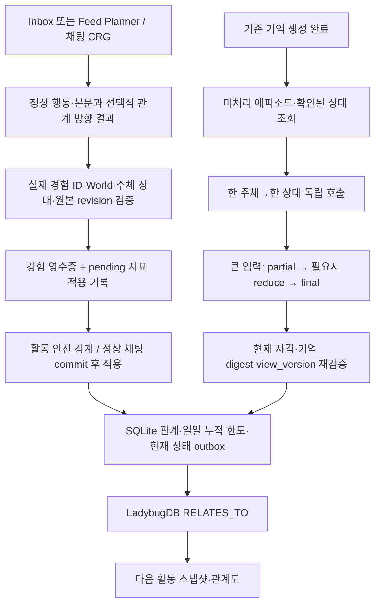

# 관계 개인화: 구현 구조와 검증·운영 인계

> 실행일: 2026-09-22 / 브랜치: `feat/sns-relationship-context` / 시작 HEAD: `def5953a`
> 상태: 로컬 구현·선택한 자동 회귀·위임 UI 확인 완료, 실사용 검증 인계. 실제 새 활동·하루 AI 결과에 대한 USER CHECK는 아래에 별도 보존한다.
> 기준: workspace의 `09-21 관계 유형·지표·인식과 하루 관계 정리·LadybugDB 구현 세부 계획.md` RI0–RI17.

## 1. 이번에 구현한 범위

- SQLite v17에 관계 유형 `relationship_label`, 인식 `perception`, 관점 버전·변경/검토 시각을 추가했다. 네 지표와 기존 ID·기억·Feed 관찰을 보존한다.
- 관계 지표는 경험을 접한 주체의 제한된 AI 해석을 사용한다. Inbox/Feed Planner와 채팅 CRG의 기존 호출에 결과를 결합한다. Writer는 관계를 다시 판단하지 않는다.
- 관계 유형·인식은 새 경험으로 만들어진 저장 에피소드 전문을 확인된 상대별로 종합한다. 기존 기억 생성 묶음·선택 프롬프트·저장 과정은 변경하지 않는다.
- LadybugDB v3의 방향 `RELATES_TO`에 유형·인식·네 지표·버전을 투영하고 관계도 및 채팅/SNS 스냅샷에서 읽는다.
- 사용자 조종 인물의 새 생성·다른 인물 선택·기존 인물 복귀를 제공한다. 이전 인물을 향한 관계/채팅 ID를 보존한다. 자율 NPC를 사용자 인물로 선택하는 서버 요청은 거절한다.
- `AutonomousActivityGraph` 통합이나 전체 SNS 입력 효율화는 이번 작업에 포함하지 않는다. 후속 계획은 아래 공통 서비스와 경계를 재사용한다.

## 2. 실제 호출·저장 흐름

### 실시간 지표

주요 소유 파일:

- `app/domains/relationships/contracts/metric_interpretation.py`: 상승/유지/하락과 입력 근거 ref 파싱. 잘못된 관계 메타데이터를 정상 본문 실패와 분리한다.
- `policies/personalized_metrics.py`: 친숙도 접촉 +1(일일4), 호감·긴장 ±1(방향별 일일4), 신뢰 ±1(방향별 일일2). 친숙도·긴장0..100, 호감·신뢰−100..100. 채팅/SNS가 같은 방향의 일일 한도를 공유한다.
- `service/personalized_metrics.py`: source unique key, SQLite 쓰기 fence, 최신 state/budget 재조회, 실제 delta·state_version 저장, outbox 원자 처리.
- `app/runtime/relationships/experience_metrics.py`: 실제 확정 채팅 메시지·고정 requester ID 또는 실제 전달된 게시글의 revision을 검증한다. 서버가 확정한 턴 기준이며, 클라이언트가 응답을 끝까지 받았는지가 중복 키가 아니다.
- `social_metrics.py`: Planner 전에 후보의 실제 원본 ref를 고정하고, 유효 판단 후 stage, 활동 종료 시 적용한다. 댓글 없이 지나가도 경험 해석을 반영할 수 있다. 검색 후보만으로 stage하지 않는다.
- `app/runtime/chat/generation_workflows.py`: 정상 response lifecycle과 결합, 기존 recent_context를 재사용한다. CRG thought OFF에서도 관계 결과를 받을 수 있다. 화면에는 text만 제공한다.

동일 사용자 메시지 재생성과 같은 게시글의 Feed/Inbox 재등장은 source 키로 추가 가산하지 않는다. 경험 뒤 오류가 나면 durable pending을 코드로 복구한다. 복구를 위한 AI 재호출은 없다. 기존 목적·좋아요·팔로우·관찰의 고정 가산은 interpreted 모드에서 실행하지 않는다. 행동/관찰 기록은 보존한다.

Routine의 혼자 하는 계획·작성에는 실제 상대 경험이 없으므로 새 관계 해석을 만들지 않는다. 향후 Routine이 실제 상대 자료를 받게 되면 같은 경험 서비스에 연결한다.

### 하루 유형·인식

- `app/runtime/relationships/review_memories.py`: 같은 owner·World·subject의 유효한 저장 에피소드를 페이지100개로 조회한다. 대표 상대가 비어도 기존 원본 근거에서 단일 상대가 확인되면 포함한다. 정정으로 새 기억 ID가 만들어졌다면 기존 에피소드의 superseded_by_id 계보를 따라 포함하며, 임의의 일반 기억을 에피소드로 바꾸지는 않는다. 여러 상대·미관찰·다른 World·변경된 근거는 제외 사유를 기록하며 이름으로 추측하지 않는다.
- `review_identity.py`: 자기 승인 정보와 상대 이름, 유효한 World 참여·차단을 검증한다. 다른 캐릭터의 사적인 인식을 전달하지 않는다.
- `review_runtime.py`: 기억 queue가 비었을 때 실행하는 후순위 worker. 기존 기억 설정의 동의·모델·시간대·예약 시각을 사용한다. 새 기억 없는 상대는 호출하지 않는다. 하루 root 완료 뒤 늦게 저장된 기억은 다음 일일 검토에 남는다.
- `service/daily_review.py`: manifest 고정, lease, 중간 결과/digest 저장, retry, 분할·다단계 종합, view 충돌 rebase, 최종 한 번 적용.
- `review_refresh.py`: 삭제·만료·변경된 기억과 설정/주체 변경을 다시 확인한다. 영향을 받은 부분과 상위 종합을 다시 준비하고, 관계 지표는 재가산하지 않는다.
- `app/integrations/llm/relationship_review.py`: 기존 기억용 자격 증명·모델/Thinking 설정을 사용하는 별도 관계 정리 호출. 정상 기억 생성을 다시 호출하지 않는다.

단일 요청은 지침 포함 24,000자·72,000바이트 예산으로 분할한다. 전문 한 개를 임의로 자르지 않는다. 부분 결과의 source refs를 종합 입력에 보존한다. 제공자가 출력을 끝내지 못하면 같은 상대 안에서 더 작게 나누며, 한 항목마저 완료하지 못하면 오류/재개 상태를 보존한다. 중간 판단은 현재 관계로 노출하지 않는다.

`MemoryBatchRuntime.idle_work`에 연결했으므로 기억 생성 작업 사이에서 우선권을 양보한다. 관계 호출 하나가 진행 중이면 중간 취소 없이 해당 요청의 timeout 경계까지 걸릴 수 있다. 새로운 하루 호출 횟수나 금액 상한은 추가하지 않았다.

## 3. 원본과 투영의 책임

| SQLite 원본 | 목적 |
|---|---|
| `relationship_states` | 현재 네 지표·유형·인식·각 버전/시각 |
| `relationship_policies` | World별 해석 모드·최초 적용 경험 경계 |
| `relationship_experience_receipts` | 실제 경험 source key/revision 및 고정 주체/상대 |
| `relationship_metric_applications` | optional 메타데이터 상태, pending/실제 delta/적용 버전 |
| `relationship_metric_budgets` | 같은 방향의 채팅/SNS 일일 누적 한도 |
| `relationship_review_work` | 상대별 직접/부분/종합 작업, manifest, 결과, lease, retry |
| `relationship_review_memory_receipts` | 처리/제외된 기억과 digest·사유 |
| `graph_projection_outbox` | 기존 SNS 사건 또는 사건 없는 현재 상태 snapshot |

Ladybug는 SQLite에서 재구성 가능한 조회 투영이다. 채팅/일일 정리에 가짜 SocialEvent를 만들지 않는다. 낮은 state version의 투영은 건너뛰고 같은 version에 다른 payload가 오면 충돌로 거절한다. graph 장애 시 canonical fallback의 유형·인식도 동일하게 제공한다.

자기 채팅에서 형성된 인식은 자기 SNS에서 사용할 수 있다. 채팅 출처를 이유로 문구를 비우거나 별도 공개 승인 AI를 호출하지 않는다. 다른 주체·World의 경험을 자기 경험으로 복사하지 않는다.

## 4. 전환과 실행 중인 Docker

- 신규 SQLite v17과 v16 upgrade의 schema digest가 일치한다. 이전 migration manifest는 변경하지 않았다.
- Ladybug v3에 새 필드를 반영하고 canonical 데이터로 재구축한다.
- worker 시작 전 `activate_relationship_policies`가 아직 policy가 없는 World의 전환 시각을 저장한다. 기존 policy가 있으면 시각을 바꾸지 않는다. 새 World 생성도 같은 계약으로 등록한다.
- 전환 전 기억/수치를 초기화하거나 과거 기억 전체를 AI로 분석하지 않는다. C안 Feed 전환 경계는 별개로 그대로 유지한다.
- Compose 재빌드/기동 완료. 기존 named volume 보존. Windows 설치형 앱을 조사하거나 변경한 작업이 아니다.
- 실제 Docker current-generation v17 확인. v16/v17 비교: 기억159, 관계4, Feed관찰30, 게시글181로 동일. 두 DB 모두 foreign_key_check 오류0. World3개 interpreted, 관계 작업0, 지표 적용0 확인(새 활동 대기).

## 5. 로컬 검증 증거

### 자동 검증

- 관계·CRG·SNS·Ladybug·persona 관련 묶음: **289 passed / 1 skipped**. skip는 PostgreSQL 전용 SKIP LOCKED 동시성 검사(DB URL 미설정)이며 SQLite 기반 이번 실행의 PASS로 계산하지 않았다.
- 기억·migration·추가 회귀 묶음은 43개 통과 후 테스트 fixture의 owner binding 1개 실패를 수정했다. 해당 수정과 지표/일일 재검증 12개 통과, 에피소드 정정 계보 추가 테스트1개 통과. 처음 실패를 삭제하거나 전체를 한 번에 통과한 것으로 합산하지 않는다.
- frontend `pnpm typecheck`, 수정 파일 ESLint 통과.
- 기존 Playwright runner의 `relationship-graph/product-shell.spec.ts`: **3 passed**. ready/empty/degraded/unavailable, 긴 관계 문구·인식 펼치기, 키보드,200% 확대, 조회 mutation 없음.
- 별도 구현 테스트: source replay, 실제 정상 chat commit→pending→apply, SNS no-action·교차 경로 중복, 대표 상대 null 단일 근거 보완/다중 제외, partial 실패 재개, incomplete 분할, 변조된 결과 거절, view 충돌 rebase, eventless Ladybug 재구축/역순/동일버전 충돌.

최초 실패와 수정: 누락 import 및 기존 mock 문맥 보완; migration fixture를 새 v17/graphv3에 맞춤; 관계 route 수2→3 기대값 수정; 테스트의 지표 actor/target 필드명 수정. 표준 실행은 `uv run python -m pytest`이며 `uv run pytest`의 app import 오류는 실행 환경 문제였다.

**미실행:** `scripts/ci/check_architecture_boundaries.py`는 자동 승인 검토가 사용자 CI 금지 범위로 판단해 거절했다. 우회 실행하지 않았다. 소유 문서와 의존 경계를 코드로 확인했지만 해당 자동 검사 PASS를 주장하지 않는다. PR·push·원격 CI·main merge 없음.

### 위임받은 실제 화면 확인

`http://127.0.0.1:3000`의 올마이트·미도리야 관계도에서 새 상태 조회200, interpreted, scheduled, 과거 자동 정리0건을 확인했다. 새로고침2회, 키보드 링크 focus,200% 확대의 상태표시를 확인했다. 관계도 조회에서 auth 외 mutation 요청0, 관계 AI를 실행하는 요청0.

이는 **DELEGATED UI CHECK**이며 사용자가 실제 AI 행동의 자연스러움을 확인한 USER CHECK와 구분한다. 기본 CUA 도구가 Node 종료로 작동하지 않아 격리 Edge Playwright를 사용했다. World 편집창에서 아오이 하루 및 “다른 내 앵무 새로 만들기” 선택지를 확인했다. 실제 계정의 인물 교체·채팅 전송·강제 SNS 활동을 수행하지 않았다.

증거: `evidence/relationship-local-ui.json`. 재현용 `backend/scripts/check_relationship_local_ui.py --world <World ID> --characters <Character IDs>`는 기존 대상에 GET 화면 확인만 수행한다.

## 6. RI15 합성 측정과 해석 범위

Windows11 / Python3.13.12, 임시 SQLite, provider 호출0, 기존 source 영수증이 한 방향에 집중된 조건. 각 조건100번의 실제 commit을 측정했다. 사용자 DB를 부하 fixture로 사용하지 않았다.

| 기존 경험 수 | 지표 transaction p50/p95(ms) | 동일 상대 기억 분할 수 | 분할 준비(ms) | 추적 peak MiB |
|---:|---:|---:|---:|---:|
|1,000|23.53 / 28.87|16|157.30|0.43|
|10,000|23.28 / 27.42|156|1,554.82|4.19|
|100,000|23.59 / 28.97|1,563|15,919.39|41.94|

처음의 JSON 재직렬화 방식은 100,000기억 분할에109,492.93ms가 걸려, 항목당 직렬화 한 번과 누적 길이 계산으로 수정했다. 동일 분할 수를 유지하면서 약6.9배 단축됐다. tracemalloc 계측 비용이 포함됐다.

이 측정은 **전체 500캐릭터 동시 실행, 실제 기억 source 조회, graph rebuild 대량 부하, 실제 AI 토큰/품질·응답 지연의 검증이 아니다.** 해당 항목은 미측정으로 남긴다. 큰 단일 상대의 미처리 기억은 페이지 조회 이후 한 manifest 준비 과정에서 메모리에 모이므로, 큰 backlog 처리 시 메모리/worker 점유가 증가한다. 실사용 규모가 커지면 디스크 기반 manifest 준비·발견 checkpoint를 검토할 지점이다.

원본 묶음과 저장 기억의 실제 모델 의미 비교도 아직 수행하지 않았다. 기억 기반이 원본과 동등하다고 단정하지 않는다.

## 7. 남은 USER CHECK / 운영 관찰

1. 전환 이후 정상 채팅1회: AI→당시 사용자 인물의 지표만 반영되는지, 응답 재생성으로 추가 가산되지 않는지. thought ON/OFF 모두 확인.
2. 새 Feed/Inbox 활동: 같은 경험을 캐릭터가 다르게 해석하는지, 무행동이어도 필요한 지표가 변하는지, 댓글 목적 고정 보너스가 중복되지 않는지.
3. 기존 기억 예약 이후 새 에피소드가 정상 생성되고, 같은 상대의 기억만으로 유형·인식이 생성/유지되는지. 실제 모델의 의미 손실·과도한 변화/허구/상대 오귀속 확인.
4. 자기 채팅에서 형성된 인식이 자기 SNS 행동에 실제 영향을 주는지. 다른 캐릭터에게 사적인 경험이 자동 복사되지 않는지.
5. 실제 provider 제한/중단·재시작 뒤 완료 부분 재사용과 최종 한 번 적용. 이전 정상 문구가 대기 중 유지되는지.
6. 사용자가 원할 때 새 사용자 인물을 만들고 복귀하여 기존 관계가 그대로 이어지는지. 서버 고정ID/거절은 자동 검증했고 실제 계정은 변경하지 않았다.
7. C안 독립 게시·댓글·후보/노출 회귀, 빈번한 채팅과 SNS 병행의 체감 지연, 장기 backlog/DB 증가.

관계도에 유형·인식이 아직 없는 것은 적용 전 기억을 자동 정리하지 않는 계약과 일치한다. 실제 새 기억과 하루 작업 완료 전에 생성됐다고 판단하지 않는다.

## 8. 다음 작업에서 재사용할 경계

- 입력 효율화: 기존 `social_snapshot.prompt_view()`와 feed author context에 들어가는 label/perception을 중복 없이 배치하되 World·주체·관계 버전을 유지한다.
- AutonomousActivityGraph: `prepare_sources → stage_sources → settle_activity`의 경험/안전 경계를 서브그래프 전후에 보존한다. 노드를 다시 호출한다고 같은 경험을 새 event로 만들지 않는다.
- 하루 관계 정리는 SNS 활동 그래프 밖 후순위 worker다. 통합 시 이를 매 활동 호출로 옮기지 않는다.
- 향후 튜닝은 `policies/personalized_metrics.py`, `policies/daily_review.py`에서 하고 저장 계약·migration·중복 키와 AI 결과의 실제 근거를 함께 검증한다.

### 최종 보완 기록

- 인물 교체 후 inactive로 보존된 owner-controlled 상대의 기존 경험을 계속 확인할 수 있도록 canonical memory participant 조회를 보완했다. inactive 자율 캐릭터를 허용하는 변경은 아니다.
- 정정된 에피소드의 replacement ID 계보를 재귀 조회하여, 원래 에피소드의 후속 정정이 일반 기억으로 잘못 빠지지 않도록 했다.
- CRG thought ON/OFF × 관계 메타데이터 누락/오류에서 정상 답변 보존·provider1회 계약을 추가 검증했다.
- 최종 Docker health: backend/frontend healthy, API status ok / sqlite / ladybug. 로컬 테스트 캐시·개발 데이터를 Docker context에서 제외하도록 `.dockerignore`를 보완했다. 캐시와 사용자 볼륨은 삭제하지 않았다.
