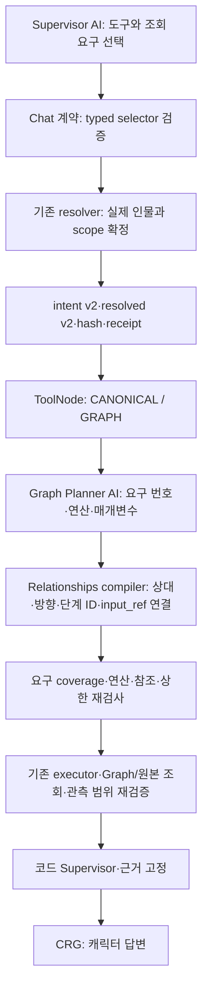

# Graph 조회 계약 GC 실행 기록

- 상태: **GC0–GC10 실행·판정 완료 — 결합 후보 HOLD, 기본 NA 복귀**
- 기준: 2026-09-13, `fix/chat-retrieval-debugging`, `ee8eabf7c68e5a7fb7a5c4e9d11dc0e4d2a56a8d` + 기존 dirty 97행.
- 보존: 워크스페이스 `.task-output/graph-contract-gc-20260913/source-before.zip`, 파일별 SHA256, status, diff. HEAD로 원복하지 않는다.
- 기준선 테스트: 최초 루트 실행은 app import 실패. backend에서 재실행 **286 passed**, 기존 Starlette 경고 1건. 구조 검사 통과. 보존 검사는 기준선부터 mark_terminal 불일치이며 현재도 동일하다. 이를 통과시키려고 manifest를 갱신하지 않았다.
- 실행 모델 예산: 개발16 + 동결 보류96 + 브라우저10 = 최초 요청122. 개발 16 + 보류 96 + 브라우저 10 = 122요청 완료. 요청 repair1, 물리 시도2/논리 호출. 기존 추가 승인 재사용 없음.
- 실제 모델·브라우저·사용자·CI·설치 검증은 각각 독립 Gate다.

## GC1 구현 계약

후보는 `graph_query_contract=True`로 명시적으로 선택한다. 기존 NA 기본값은 검증 전 유지한다. B positional_entity_refs와 동시에 사용하지 않는다.

1. 모델 인물 선택은 `{kind: responding_character|requester_character|mention, index: null|1..4}`. builtin은 index=null, mention은 존재하는 목록 번호만 허용한다. entities에는 mention/role만 있고 코드가 entity-N alias를 발급한다. Canonical용 relationship의 from/to도 같은 selector를 사용하고 내부에서는 기존 단방향 의미로 변환한다.
2. Graph 의미는 최대3개의 `graph_queries` 요구다. 각 요구는 `kind: pair|collection|shared|path`, `direction: outgoing|incoming|bidirectional|either`, `target: selector|null`, `result_of: null|이전 요구 번호`다. 모든 기준/관측 주체는 현재 응답 캐릭터다. collection은 target/result_of가 없고 나머지는 target 또는 result_of 중 하나다. result_of는 유일한 생산 단계를 가진 앞 요구의 인물 결과를 뜻한다. 이름이나 UUID를 미리 생성하지 않는다.
3. 양방향은 pair에서만, either는 shared/path에서만 허용한다. 목록 양방향은 두 collection 요구로 명시한다. pair의 bidirectional은 실제 outgoing/incoming 두 단계로 확장한다. 기존 concrete 최대3단계 제한을 확장 후 적용한다.
4. Graph Planner는 요구 번호와 기존6개 연산, 연산별 limit/ranking/hops/depth를 작성한다. 확정된 상대·방향·내부 단계ID/input_ref는 작성하지 않는다. 코드가 요구와 연산의 호환성, 요구 coverage, 선행 결과 의존, 확장 상한을 검사하고 기존 graph-plan.v1 실행 계획으로 구체화한다. 한 요구에 direct+evidence처럼 복수 연산은 상한 안에서 허용한다. 결과 의존 대상은 앞 요구의 유일한 생산 단계로 연결하며 모호한 복수 생산 단계는 거부한다.
5. v1 입력은 기존 parser를 유지한다. v2 intent/resolved에는 Graph 요구를 hash에 포함한다. 새 ToolNode 실행 인자 schema는 v2 요구를 추가하되 기존 인자는 그대로 허용한다. legacy parse 실패를 v2로 재해석하지 않는다. Canonical에는 별도로 명시한 relationship을 전달하며 Graph 양방향의 첫 방향으로 대체하지 않는다. BOTH는 전체 의미 일치와 기존3개 recipe를 유지한다.
6. 실행 validator는 v2에서 요구별 counterpart/direction/operation/coverage를 검사한다. 전역 단방향 제약을 모든 연산에 적용하지 않는다. v1은 기존 검증 그대로다. 임의로 틀린 필드를 덮어쓰지 않고 v2 draft에 금지 필드가 있으면 거부한다.
7. 각 concrete 단계 결과는 기존 receipt·근거·범위 계약을 따른다. 0건과 접근불가·실패를 구분한다. 빈 collection은 기존 dependency short circuit을 재사용한다. CRG 역할, 사용자 재시도 정책, observer 범위, 별도 평가 AI는 바꾸지 않는다.

## 구현 결과와 검사

| 단계 | 현재 상태와 증거 |
| --- | --- |
| GC0 | 기준선 ZIP/해시/diff 및 fixture 동결 완료 |
| GC1 | selection-args.v2.a1, intent/resolved v2, graph-draft.v2 계약 동결 |
| GC2 | builtin/mention selector 분리, 내부 alias 생성 및 resolver 검사 |
| GC3 | 확정 상대·방향·ID를 compiler가 연결, concrete coverage 재검사 |
| GC4 | bidirectional 두 단계 확장, 누락·상한·대상·방향 검사 |
| GC5 | collection/result_of 연결, 빈 결과 단축, incoming 목록 실제 사실 방향 검사 |
| GC6 | 폐쇄 오류 코드·진단, 실제 ToolNode BOTH 세 recipe × 빈/비어 있지 않은 결과 검사 |
| GC7 | 795 passed, 7 skipped, 4 warnings; frontend typecheck/lint/경계/design 통과 |
| GC8 | 개발16·보류96 완료. 후보 정확도·비용 Gate 미통과, HOLD |
| GC9 | 10건 실행·진단 확보 완료. 7답변/3실패, 실제 Graph 연산 범위 PARTIAL |
| GC10 | 후보 기본 적용 보류. 호스트·Docker 실행 NA 복귀, 자료·후속 과제 인계 |

현재 구조 inventory 1099 modules / 4135 edges 검사를 통과했다. 새 relationships 계약 모듈을 지원 경계로 명시 등록했고 facade를 추가하지 않았다. 기존 dirty 변경을 모두 포함한 검사를 수행했다. `mark_terminal` 보존 오류는 수정 전과 후 동일하게 남아 있으며 이 계획의 신규 실패로 계산하지 않는다.

### 실제 조회에서 추가 발견한 차이

기존 rank는 outgoing만 조회하고 neighborhood는 방향을 무시했다. v2 요청에만 코드 소유 `enforce_collection_direction`을 전달해 방향을 실제 적용한다. incoming rank는 기존 canonical direct 조회 최대 40개를 관측 범위로 재검증한 뒤 정렬한다. `source=canonical_fallback`, `reason=incoming_rank_bounded_canonical` 및 truncated를 유지한다. 모든 관계를 본 전역 순위라고 주장하지 않는다. 기존 v1 동작은 원복 가능하게 유지한다.

네 변경은 계약상 연결돼 있으므로 결합 후보 한 옵션으로 평가한다. 모듈별 결정적 검사와 결합 후보 실모델 비교를 구분하며, 네 개의 독립 실모델 실험을 수행했다고 표현하지 않는다.

### 평가의 범위

- frozen-cases.json의 개발 8/보류 24/브라우저 10 및 관계 원본을 사용한다. source/schema/prompt 해시와 요청 예산 원장을 저장한다.
- 개발·보류는 실제 Supervisor/Planner 모델과 production validator/executor/GraphRecallService를 사용한다. 저장소 gateway는 합성 fixture이며 실제 제품 DB를 변경하지 않는다.
- CRG 호출·최종 답변·FTS 검색 품질은 이 배치에 포함하지 않는다. Canonical fixture의 반환은 서비스 연결 보존 검사이며 검색 정확도 증명이 아니다.
- 브라우저는 실제 저장소·CRG·최종 저장을 확인하는 별도 DELEGATED CHECK다. 연속 대화이므로 앞 질문의 맥락 영향이 있고 독립 표본 정확도로 해석하지 않는다.
- 개발 runner 원점수 NA 3/8, 후보 4/8, 실행 완료 NA 5/8, 후보 8/8. 이는 route+query 요청 형식 기준이며 실제 사실까지 일치하는 최종 성공률이 아니다.
- 개발 dev-4의 NA는 incoming 명령인데 outgoing 사실도 반환했다. dev-6의 일반적인 공통 인물 표현에는 direction either도 가능한 해석이므로 방향 oracle의 한계를 명시한다. 원점수를 덮어쓰지 않고 실제 사실 검토를 별도 열로 남긴다.
- 개발 dev-2 후보는 CANONICAL을 선택했고 dev-4는 BOTH를 선택했다. dev-5는 순위 후 직접 조회 요구를 누락했다. 이런 최초 의미/도구 선택 오류는 코드 binding으로 자동 해결되지 않는다.

결과의 의미적 품질을 다시 판단하는 AI, CRG 도구 호출, 공유 repair 확대, provider별 의미 분기를 추가하지 않았다. 다른 실모델 정확도는 검증하지 않았다.
## 실제 책임 연결

| 요구 | 모델이 고르는 것 | 코드가 확정하는 것 | 남는 한계 |
| --- | --- | --- | --- |
| pair | 상대 selector·요구 방향·direct/evidence 연산 | resolver 결과 연결, 양방향 두 단계 확장 | 최초 상대/방향 의미가 틀리면 그 의미대로 실행 |
| collection | 방향·rank/neighborhood·limit/ranking/depth | 미정 상대를 만들지 않고 조회 | 순위 기준·limit 또는 요구 자체 누락 가능 |
| shared/path | 대상·방향·연산 한도 | 요구별 binding, 관측 범위 재검사 | World 전체 연결이 있어도 허용 근거가 없으면 제외 |
| result_of | 선행 요구 번호와 후속 종류 | 유일한 생산 단계의 실제 결과 참조 | 최초 모델이 후속 요구를 생략하면 compiler는 원문에서 복구하지 않음 |

이번에는 자연어 해석을 백엔드의 한국어/영어 분기로 옮기지 않았다. 정확한 의도 선택과 질문 전체의 요구 추출은 여전히 모델 책임이다. 코드가 보장하는 것은 **수용된 구조화 요구의 연결·실행 제약**이다.

## GC8 완료 — 결합 후보 채택 보류

동결 보류 24문항 × 2반복 × 2구성 = 96요청을 모두 실행했다. 개발 이후 app/prompt/schema를 바꾸지 않았다. 각 요청은 같은 합성 초기 문맥이며 concurrency=2, deadline=95초, gemini-3.1-flash-lite/high와 기존 출력 한도를 유지했다.

| 지표 | NA (48) | GC 후보 (48) |
| --- | --- | --- |
| 실행 완료 | 38 | 35 |
| 기대 경로 정확히 선택 | 38 | 27 |
| 고정 route+query 원점수 | 29 (60.4%) | 21 (43.8%) |
| 원점수 통과 + 실제 원본 사실 대조 통과 | 26 (54.2%) | 21 (43.8%) |
| 반환 관계 방향/사실 불일치 요청 | 4 | 0 |
| 자동 수정 사용 요청 | 12 | 27 |
| 조회 평가 logical / physical | 92 / 92 | 111 / 111 |

원점수와 사실 대조를 분리했다. 이 평가는 CRG를 호출하지 않으므로 위 수치를 사용자 답변 전체 성공률로 부르지 않는다. 고정 상대·방향 compiler와 관측 범위 검사는 효과를 확인했지만 결합 후보의 선택·형식·비용 Gate는 미통과다. 과거 다른 실험의 93.8%와 문항·범위가 다르므로 직접 증감 비교하지 않는다.

### 호출·토큰 집계 보정과 한계

선택 전 실패 10요청(NA2/GC8)은 runner가 routing 결과의 tracker를 받지 못했다. 해당 요청의 보존된 router failure physical_attempts와 최초/repair 기록으로 누락 호출을 포함했다. 토큰 수집은 tracker 객체 ID 재사용 때문에 3요청(NA1/GC2)에서 일부 사용량이 덮여 있다. 원본 호출 집계는 보존됐으나 해당 토큰은 소급 복원할 수 없으므로 아래는 **수집된 사용량의 하한**이다. 전체 토큰 비용의 정확한 증감률을 주장하지 않는다.

- NA: input 249,887 / output 12,855 / thought 137,325 (47/48요청 토큰 호출 범위 일치).
- GC: input 423,754 / output 16,646 / thought 189,565 (46/48요청 일치).
- 개발은 NA20/GC20, 보류는 NA92/GC111으로 브라우저 전 최초112요청, foreground logical/physical 합계243이다. 브라우저10의 30/30을 합쳐 전체122요청, 273/273이다.

### 지연 (CRG 제외, route별 서로 다른 표본)

| 실제 경로 | NA n / p50 / p95 ms | GC n / p50 / p95 ms |
| --- | --- | --- |
| GRAPH | 24 / 24,752 / 46,510 | 12 / 32,005 / 42,268 |
| BOTH | 2 / 25,677 / 26,338 | 10 / 45,406 / 67,566 |
| CANONICAL | 4 / 18,082 / 19,801 | 6 / 21,070 / 39,889 |
| CURRENT_CONTEXT | 4 / 10,631 / 13,044 | 4 / 8,162 / 12,703 |
| CLARIFICATION | 12 / 10,403 / 17,924 | 8 / 6,294 / 15,042 |

경로 오선택·repair·실패 여부 때문에 동일 질문의 동등한 작업량 비교가 아니다. 특히 BOTH/Canonical의 20% 초과 악화를 숨기지 않으며 속도 개선이라고 결론내리지 않는다.

### 남은 문제

1. Graph 대신 Canonical/BOTH 또는 불필요한 clarification 선택.
2. graph_queries 비어 있음, 대상/종속 지정 누락, 후속 요구를 최초 의미에서 빠뜨림.
3. Canonical용 relationship에 자기 자신 쌍을 작성하는 오류가 새 selector에서도 남음. 새로운 참조 ID 방식만으로 의미 입력 오류가 없어지지 않는다.
4. Planner의 불필요한 매개변수, 양방향 요구 확장 후 단계 상한 초과.
5. MAX_TOKENS/MALFORMED_FUNCTION_CALL 종료. 제공된 종료 사유는 확인했지만 스키마 길이만의 인과로 단정하지 않는다.
6. 일부 v1 진단 shape 표시는 typed selector object를 invalid_type로 표시한다. 이는 diagnostic_shape_only이며 실제 입력 판정은 normalized_arguments와 validation_code를 봐야 한다. typed wire 단계의 kind/index 진단 표시는 후속 보완 대상이다.

다음 개선은 위 실패를 구분해 설계해야 한다. 이번 평가 중 이름/문구 분기, 모델 변경, 출력 상한 증가, 관측 범위 완화로 점수를 올리지 않았다. 새로운 인자 오류와 의미 회귀가 발생했으므로 결합 후보 기본 적용은 HOLD다.

수집기 보완(평가 종료 후): `evaluate_graph_query_contract.py`가 요청 동안 tracker 객체를 함께 보관하도록 수정해 다음 실행에서 객체 ID 재사용으로 토큰이 덮이지 않게 했다. 기존 112요청을 재실행하거나 빠진 토큰을 추정해 채우지 않았다. 해당 수정은 모델 입력·제품 동작을 바꾸지 않으며 py_compile을 확인했다. 당시 실행 소스는 evaluation-source.tar.gz에 보존돼 있다.

## GC9 — 실제 브라우저 10문항 완료, Gate PARTIAL

Edge의 실제 contributor 채팅에서 사전 동결 10문항을 각각 1회 보냈다. 상세 캡처 ON, 요청 ID별 JSON 10개와 DB 요청 상태·호출 집계를 확보했다. 모델은 모든 요청에서 gemini-3.1-flash-lite/high였으며 재시도 버튼을 누르거나 추가 문항을 보내지 않았다. 연속 대화의 맥락을 유지한 시험이므로 독립 정확도 시험과 구분한다.

| 번호 | 경로 / 상태 | 실제 확인 | 요청 ID |
| --- | --- | --- | --- |
| 1 | CURRENT_CONTEXT / committed | 수치 일치. CURRENT_CONTEXT이므로 Graph 실행 검증 아님 | `request-606fd66a532b4b6eb3204ea914473c0b` |
| 2 | CANONICAL / committed | 수치 일치. Canonical 관계 변경 조회이며 Graph 실행 검증 아님 | `request-5b74c2e2f20e459f8c671dc97d678400` |
| 3 | CURRENT_CONTEXT / committed | CURRENT_CONTEXT. 실제 양방향 Graph 실행은 미검증 | `request-e4abe78a09944b74a2296bb91466609d` |
| 4 | GRAPH / committed | 실제 incoming neighborhood 실행·근거 수치 일치 | `request-3b3f9d5ec2cd4749b27d861aa97e1d35` |
| 5 | BOTH / failed | 실패. Graph 실행 전 차단 | `request-37a237088c5147c8aa6ab3062f0ee578` |
| 6 | GRAPH / committed | 실제 shared 조회 후 후보 제외. 확인 못함 답변 적절 | `request-8c93066e0e0f4c60a43698efd21ac968` |
| 7 | CURRENT_CONTEXT / committed | CURRENT_CONTEXT. 최단 경로 연산 실행 검증 아님 | `request-09cfcde0e61e4cc594390101608cbe99` |
| 8 | CANONICAL / committed | CANONICAL 실행·기억 근거와 답변 일치 | `request-8eaa9a8645364b80840ba6e54f84e5ed` |
| 9 | BOTH / failed | 실패. 두 축 동작 보존의 실제 UI Gate 미통과 | `request-1959d72ecdcc4833b2b217e448aa89e7` |
| 10 | BOTH / failed | 불필요한 BOTH 선택 후 실패 | `request-59d3a68371b9474789aa6bee77d3527e` |

실제 Graph 실행은 4번 incoming neighborhood와 6번 shared_neighbors에서 확인했다. 1·3·7번은 현재 맥락을 사용했고 2번은 CANONICAL로 처리했으므로, 답변 수치가 맞더라도 각각 고정·역방향·양방향·최단 경로 Graph 실행 통과로 세지 않는다. 8번은 저장 기억 근거와 답변이 일치했다. 6번은 후보 1건을 관측 범위에 따라 제외했으며 원문 관계가 존재한다는 이유로 비공개 범위를 넓히지 않았다.

실패 3건의 직접 차단 원인:

- 5번: Supervisor의 `graph_selection_person_unbound`를 기존 repair로 수정한 뒤, Graph Planner가 `graph_draft_requirement_invalid`에서 차단됐다. 공유 repair는 이미 사용했다. 잘못된 요구 번호의 원시 값은 기록하지 않아 숫자/타입의 세부 원인은 미확정이다.
- 9번: BOTH 선택 후 Graph Planner 최초·repair 모두 `graph_plan_step_limit_exceeded`. 실제 Graph 실행 및 CRG 전 종료했다.
- 10번: 인사 질문에 불필요한 BOTH를 선택했다. Canonical 조회는 실행됐지만 Graph Planner 최초·repair 모두 같은 `graph_plan_step_limit_exceeded`로 실패했다. 대화 앞선 맥락의 영향 가능성은 있으나 모델 내부 원인을 확정하지 않는다.

**단계 오류 해석의 한계:** 현재 compiler의 `graph_plan_step_limit_exceeded`는 steps가 목록이 아닌 경우, 길이가 0 또는 3 초과인 경우, 구체화 후 3단계 초과인 경우에 공통 사용된다. 따라서 9·10번은 “단계 계약 위반”까지 확정이며, 상세 JSON에 실제 steps 타입·개수·확장 전후 수가 없으므로 반드시 4개 이상 작성했다고 단정하지 않는다. 초기 진행 설명의 “단계 수 초과”는 이 범위로 보정한다. 후속 진단은 원문 전체 대신 이 수치와 실패 검증 위치만 추가하는 것이 적절하다.

세 실패 모두 DB `retryable=0`이었고 UI에 재시도 버튼이 없는 상태와 일치했다. 이번에는 사용자 재시도 정책·불확실성 CRG 대체 답변을 변경하지 않았다. 실패를 0건/정상 답변으로 바꾸지 않았다.

원본 관계 스냅샷 전후 동일: **True**. 시험 중 캐릭터 관계를 수동 수정하거나 메시지를 삭제하지 않았다. 실제 제품의 채팅 저장·후속 작업과 foreground 호출 비용은 구분한다. 브라우저 foreground logical/physical은 **30/30**, 개발·보류 포함 **273/273**, 최초 요청 **122/122**다. 비동기 기억화 등 제품의 배경 작업을 이 foreground 집계에 포함한 것은 아니다.

아티팩트: workspace `.task-output/graph-contract-gc-20260913/browser-results.json`, `browser-01.json`–`browser-10.json`, `browser-request-metadata.json`, `browser-source-before.json`, `browser-source-after.json`, `final-summary.json`. DB 시각은 원본 UTC를 유지하며 문서 작성일 KST와 구분한다. raw 세션/프롬프트·자격 증명을 문서에 옮기지 않았다.

## GC10 — 기본 NA 복귀·인계 완료

- 결합 후보는 **HOLD**다. 구현과 평가 수행 완료를 채택 Gate 통과로 표현하지 않는다.
- 호스트 `backend/app/runtime/chat/generation_workflows.py`와 실제 Docker backend 모두 NA 구성: `native_controls=True`, `code_coordination=True`, `positional_entity_refs=False`, `graph_query_contract` 기본 False. 새 구현은 소스에 남아 있지만 기본 경로에서는 비활성이다.
- 후보의 실제 브라우저 검증 후 보존된 NA composition으로 만든 로컬 이미지로 backend만 재생성했다. 컨테이너 health=healthy, 호스트/컨테이너 composition SHA256 `167a444ada6867901993e80f9fe9f910aa80cb0054c5c327cd3156ad5d699ed1` 일치. frontend·볼륨·사용자 자료·다른 컨테이너는 원복 수단으로 삭제하지 않았다.
- 현재 브랜치와 기존 미커밋 변경을 유지했다. CI/직접 USER CHECK/설치형/타 실모델 일반화는 미검증이다. 기존 `mark_terminal` 보존 검사 실패도 별도 미해결 Gate다.
- 다음 작업은 신규 후보를 바로 켜는 것이 아니라, (1) Graph 단독 요구에 불필요한 Canonical relationship 작성 책임, (2) 요구 번호와 단계 타입·개수 계약, (3) 최초 선택의 과잉 BOTH/후속 요구 누락을 나눠 검토하는 것이다. 신규 스키마를 단순화할 경우 새 보류 표본을 준비하며 이번 보류 문항으로 반복 튜닝하지 않는다.
- 확정 값의 코드 연결·양방향 표현·관측 범위 검증의 이점은 결정적 검사와 일부 실제 실행으로 확인했다. 전체 모델 정확도 향상은 확인되지 않았고, 이 결과만으로 모델의 최종 성능 한계 또는 구조 개선의 무용함을 단정하지 않는다.
