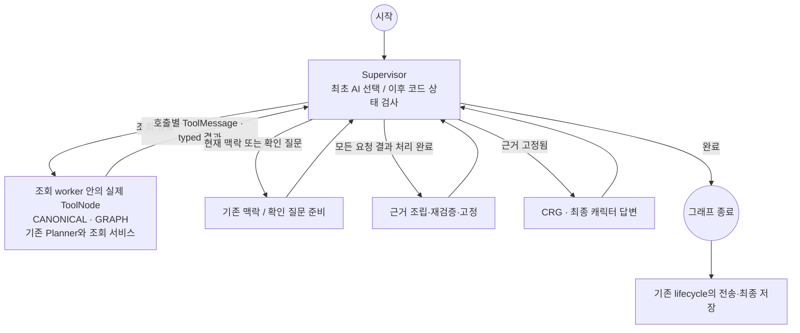

# 채팅 Supervisor native 도구 호출 로컬 검증 — 2026-09-11

09-11 검증 상태(이력): **WORKTREE IMPLEMENTED · AUTOMATED CHECK PASS · REAL MODEL GATE FAILED · DOCKER ADOPTION HELD**.

최신 후속(2026-09-12): [NA 로컬 적용 기록](chat-supervisor-argument-validation.md)에 따라 사용자 요청으로 채팅 composition에 네 함수 표현과 A를 활성화했다. B는 OFF이며 실제 서버 실행·사용자 검증은 별도다. 이 문서의 R7 실패·R8 보류와 후속 P6의 전체 채택 Gate 미충족 이력은 변경하지 않는다.

이 기록은 `fix/chat-retrieval-debugging`의 로컬 후보에 관한 것이다. 실행 시작 HEAD는
`ee8eabf7c68e5a7fb7a5c4e9d11dc0e4d2a56a8d`이며 기존 미커밋 변경을 포함해 보존했다.
새 commit·PR·merge·release·설치 앱 검증은 수행하지 않았다. 운영 중 채팅 서버의
새 구조 적용 완료나 사용자 확인 완료를 뜻하지 않는다.

## 구현한 책임과 흐름

- `runtime/chat/response_graph.py`: 독립 `route_and_resolve` worker를 등록하지 않는다.
  최초 Supervisor 실행 안에서 선택 adapter와 기존 guard/resolver를 실행한다.
  내부 action/phase와 tracker의 역사적 Router 명칭은 호환을 위해 남아 있지만
  별도 Router AI 호출은 없다. 정상 의미 단계 5회, 상위 graph step 8회이며 상한은 10이다.
- `integrations/llm/supervisor_selection.py`: 최초 모델 응답에서 실제 native 호출을 읽는다.
  본문의 호출처럼 보이는 JSON을 함수 호출로 바꾸지 않는다. 추가 결과 평가 AI는 없다.
- `domains/chat/contracts/supervisor_selection.py`: 도구명, 인자, no-tool 제어값을 검증한다.
  `CANONICAL`과 `GRAPH`만 등록한다. `BOTH` 도구는 없고 두 호출의 집합을 기존 BOTH 의미로 정규화한다.
- `runtime/chat/retrieval_tools.py`: 요청별 ContextVar 원장, ToolNode 실행, 호출 ID·범위·계획·단계 결과 대응을 검사한다.
  ToolNode는 설치된 LangGraph API의 Runtime 주입을 받도록 작은 내부 StateGraph에서 실행하며 상한은 3이다.
  provider가 요청한 ID를 보존하고, 코드 guard가 추가한 호출은 별도 ID와 `code_guard` 출처를 갖는다.
- BOTH는 기존 coordinator의 병렬, Graph→Canonical, Canonical→Graph recipe와 의존 결과 전달·병합 정책을 재사용한다.
  독립 두 조회는 ToolNode 배치로 병렬 실행한다. 동일 SQLAlchemy Session을 별도 thread에 배포하지 않는다.
- CRG는 검증된 근거와 한계를 받아 답변만 생성한다. 도구 호출·재검색·결과 평가 역할은 추가하지 않았다.

## 입력·반환 계약

native 도구의 공통 인자는 `intent`, `entities`, `relationship`, `time_scope`,
`aggregation`, `coordination_hint`의 정확한 6개 필드다. 두 도구를 함께 요청할 때는
같은 전체 질문 의미와 coordination hint를 전달한다. 하나만 요청하면 hint는 null이다.
DB ID·쿼리·owner·World·실행 권한·예산은 모델 입력 인자가 아니다. 기존 entity enum/ref,
주체·상대 식별, 시간·방향·Today SNS guard와 허용 연산 검증을 유지한다.

호출이 없을 때만 위 6개 필드에 `control`, `clarification_slot`을 추가한 정확한
JSON 객체를 받는다. control은 CURRENT_CONTEXT 또는 CLARIFICATION만 허용한다.
`control: CANONICAL` 같은 텍스트는 **잘못된 호출 형식**이며 검색을 실행한 것으로
간주하지 않는다. MAX_TOKENS·SAFETY 등 불완전 종료는 인자가 파싱되더라도 실행하지 않는다.

Gemini SDK 2.17.0에서 native function declarations와 자동 실행 비활성화를 확인했다.
최종 후보는 SDK의 `parameters`/`nullable` 형식과 `VALIDATED` 모드를 사용한다.
no-tool JSON schema를 global response schema로 함께 강제하지 않는다.
`VALIDATED`는 no-tool 응답도 허용하며 항상 호출하는 ANY와 다르다.
[Google function calling modes](https://ai.google.dev/gemini-api/docs/generate-content/function-calling?authuser=0&hl=en)

도구의 정의된 description은 계획의 영어 설명과 동일하다. 개발 과정에서는
용도·X/Y 예시를 특정 실패 문장으로 바꾸지 않고 wire 설명과 인자 설명을 보완했다.

코드 반환 검사는 정상/실패/취소, call ID 대응, 필수 목록·계획 단계 존재,
요청 ID·envelope hash, typed artifact, 기존 원본/범위 재검증에 한정한다.
0건은 정상 빈 결과이며, 결과 누락 또는 미실행과 다르다. 의존 결과가 없어
다음 축을 생략하면 `skipped_dependency`로 기록한다. 오류 ToolMessage는 error 상태이며
성공한 병렬 결과를 보존한 뒤 기존 실패 정책으로 전달한다.

실행 재시도는 요청 전체에서 SQLite BUSY/LOCKED 읽기 1회에 한정한다.
Planner 전체를 다시 실행하지 않는다. 기존 request-wide AI repair 1회와
logical call당 physical cap 2는 유지한다. 정상 호출 예시는 맥락 2회,
단일 조회 3회, 두 Planner 조회 4회다. 내부 정상 생략은 실제 호출로 집계하지 않는다.

## 자동 검사

- Chat 전체 + provider/직접 LLM + Today SNS: **403 passed, 6 skipped, 4 warnings**.
- 이후 오류 ToolMessage·불완전 출력 거절·취소·변조 반환을 포함한 native/Router/graph/구성/OSS 검사: **95 passed**.
- 앞선 Memory/S1/원문 의존성 포함 회귀는 438 passed, 6 skipped와 기존 구성 테스트 기대값 실패 1개였다.
  실패한 구성 기대값을 새 provider 이름으로 수정했고 위 Chat 전체 검사에 포함해 통과했다.
  Memory/S1/원문 검색 코드는 이번 후보에서 변경하지 않았다.
- architecture inventory와 boundary: modules 1,087, internal edges 4,088, legacy exact edges 0.
- frontend architecture와 design contract 검사 통과. frontend 코드·화면은 변경하지 않았다.
- 직접 의존성에 langgraph-prebuilt와 langchain-core를 명시했다. lock의 기존 package 버전을 올리지 않았다.
- 첫 전체 보존 검사에서는 구성 테스트의 추적 문자열 `router`를 새 이름으로 바꾼 점이 탐지됐다.
  기존 순서 단언과 역할 표시를 유지하고 실제 factory만 Supervisor 선택 provider로 바꿨다.
  해당 구성 검사 2개가 통과했다. 역사 baseline이나 assertion 허용 목록은 바꾸지 않았다.
- 전체 보존 재검사도 통과했다: protected lineages 2,913, current collected nodes 3,091,
  preservation items 37. API/ORM·기존 단언·노드 보존의 결과이며 전체 3,091개 실행 결과가 아니다.

명령 출력은 workspace `.task-output/chat-supervisor-tools-20260911/`에 보존한다.
예전 실패 출력과 수정 후 출력을 별도 파일로 유지한다. 최종 보존 검사 출력은
`preservation-final.txt`, 전체 상태는 `closeout-checks.json`에서 확인한다.

## 실제 모델 비교와 불합격 사유

고정 합성 32문항은 한국어 20·영어 12, 개발 8·보류 24로 나눴다.
개발 8문항만 각 3회, B0/B1/B2를 비교했다. **보류 24문항은 실행하지 않았다.**
이 결과는 실제 검색·원문 조회·CRG·사용자 대화 검증이 아니다.

| 후보 | 개발 표본 | 최초 형식 통과 | repair 후 유효 결과 | 기대 effective 경로 |
| --- | ---: | ---: | ---: | ---: |
| B0 기존 Router 지침 + JSON | 24 | 23 | 23 | 22 |
| B1 새 근거 지침 + 기존 JSON | 24 | 12 | 16 | 14 |
| B2 Supervisor + native 도구 | 24 | 21 | 23 | 20 |

B2의 과거 기록 핵심 질문은 3회 중 2회 정상 CANONICAL, 1회 형식 오류 종료였다.
실패에서는 검색 의도 CANONICAL을 native 호출 대신 control 텍스트로 표현했다.
관계 상태만 묻는 개발 질문은 3회 모두 GRAPH 대신 BOTH를 골랐다.
인사·미래 제안은 총 6회 모두 CURRENT_CONTEXT였고, 두 축을 요구한 질문은 3회 모두 BOTH였다.
구조적으로 호출 가능한 것과 안정적으로 필요한 호출만 고르는 것은 구분해야 한다.

B1에는 잘못된 entity ref와 확인 질문 대신 검색하는 문제가 있었다. B1의 wire 안내와
스키마 호환성도 불합격이므로 이 표로 description 길이의 독립적인 효과나
native 방식의 우월성을 결론 내리지 않는다. B0도 모든 경우를 맞춘 것은 아니다.

실제 기준 모델은 `gemini-3.1-flash-lite`, thinking high, 출력 한도 3,072이다.
저장된 현재 사용자 선택은 `gemini-3.5-flash-lite`/high였으며 변경하지 않았다.
평가 프로세스에서만 계획이 지정한 3.1 기준 모델을 사용했다. 로컬 모델 검증은 미실행이다.

성공 요청의 provider 보고 입력 토큰 중앙값은 B0 752, B1 856, B2 2,656이었다.
schema·wire 비용과 provider 계수 방식이 함께 반영된 값이며 설명 길이만의 효과가 아니다.
CANONICAL 최종 경로의 elapsed p95는 B0 7,631ms(n=5), B2 13,020ms(n=5)로
계획의 재측정 기준을 넘었다. 초기 concurrency 3, 이후 2·repair·큐 대기가 섞인
작은 개발 표본이므로 순수 모델 지연이나 제품 전체 속도로 일반화하지 않는다.

기존 B0/B1 지침이 같은 19회와 최종 B2 개발 8회를 시간순으로 재사용했다.
실패도 포함하며 결과가 좋은 반복만 고르지 않았다. 나머지 후보 개발·진단은
별도로 보존하고 최종 후보의 정확도 분모에 섞지 않았다.

사용자가 추가 24회를 허용해 최초 선택 한도는 312회다. 종료 시 완료 기록 135회,
중단 당시 in-flight 최대 5회를 보수적으로 포함해 예산 장부는 140회 사용,
172회 잔여다. 보고된 physical attempt 합계는 169회이며 초기 실패 5회와
중단 요청의 정확한 physical/토큰 사용량은 불완전하다. 이를 0으로 채우지 않는다.
요청당 상한 4를 적용한 현재 physical 보수 상한은 209회다.
**예산 소진이 아니라 개발 Gate 불합격 때문에 추가 평가를 중단했다.**

## 실패 → 보완 → 재검증 이력

1. 최초 native schema에서 entity ref 위반과 no-tool 형식 오류를 발견했다.
2. 중복된 전체 control schema 설명을 짧은 명시적 예시로 바꿨다.
   개발 B2 24회 중 정상 반환 17회, 기대 선택 16회로 채택하지 않았다.
3. VALIDATED 전환, global structured output 병행, SDK nullable 전달 형식을 개발 입력에서 확인했다.
   global structured output 병행은 더 불안정해 최종 후보에서 제외했다.
4. 도구명과 no-tool control의 구분, null 인자 및 두 호출의 전체 의미 동일성을 명시했다.
   최초 개발 8회는 정상 반환 8회였지만 반복 비교에서 형식 오류와 과잉 BOTH가 재발했다.
5. 비교 후 불완전 종료 거절과 오류 ToolMessage 상태를 코드로 보강하고 자동 검사를 통과했다.
   이는 실제 모델 재시험 통과를 뜻하지 않는다. 의미적 결과 평가 AI나 CRG 도구 권한은 추가하지 않았다.

## 적용 상태와 재개 지점

R0~R5 후보 구현과 R6 자동 검사는 수행했다. **R7 채택 실패로 R8 새 구조 적용과
직접 USER CHECK는 보류**다. 기존 backend 컨테이너의 `/workspace/backend` 소스는 교체하지 않았다.
실제 모델 평가는 별도 `/tmp/chat-supervisor-evaluation/source`의 파일로 실행했다.
기존 data volume `angmoo_angmoo_contributor_embedded_data`를 그대로 사용했고 새 환경을 만들지 않았다.
평가 스크립트는 DB를 mode=ro로 읽으며 Chat/SNS/Memory 저장 API를 호출하지 않는다.

남은 문제는 자연스러운 질문을 위한 검색 조건 완화가 아니다. 먼저 no-tool control과
native 선택을 안정적으로 구별하는 provider 프로토콜, 공통 의미 인자 생성,
GRAPH 단독 필요에서 BOTH로 확장되는 선택을 개발 8개에서 다시 검증해야 한다.
검증기 완화·가짜 tool call·추가 Router·결과 평가 AI로 실패를 숨기지 않는다.
새 후보가 개발 Gate를 통과하면 원래 보류 24문항과 비용/지연을 남은 승인 예산 안에서
검증한다. 보류 결과를 본 뒤 후보를 바꾸면 새 보류 집합이 필요하다.

기존 한국어 S1·원문 참조·주체 범위 수정은 보존했다. S2/P1, SNS Supervisor,
상위 캐릭터 Supervisor는 이번에 구현하지 않았다.

## 2026-09-11 제어 함수 후속 실험

[네 함수 후보 F0~F7 기록](chat-supervisor-control-validation.md)에서 동일 모델의 후속 비교를 수행했다. M1은 개발 정답 21/24였으나 terminal 계약 실패 1건으로 F2 Gate 미달이다. 기존 R7 실패 기록과 R8 보류는 유지하며, 당시 새 제어 함수 방식은 기본 비활성 실험 옵션이었다. 현재 로컬 적용은 문서 상단의 후속 기록을 따른다. 제품 조회 도구는 여전히 두 개이고 제어 함수 결과는 검색 근거에 포함하지 않는다.
