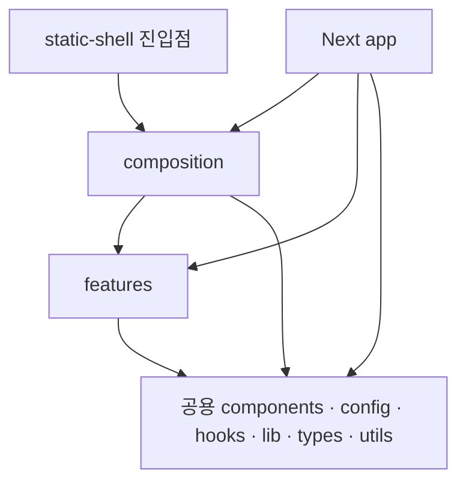

# Angmoo Frontend Architecture

Angmoo의 프론트엔드는 **기능별 코드와 공용 코드를 구분하고, 여러 기능을 화면에서 조립하는 구조**를 사용한다. Chat을 고칠 때는 Chat 기능을, 여러 화면의 공통 버튼을 고칠 때는 공용 컴포넌트를 찾을 수 있도록 책임을 나누는 것이 목적이다.

이 문서는 [Bulletproof React의 Next.js App Router 예제](https://github.com/alan2207/bulletproof-react/tree/master/apps/nextjs-app)를 바탕으로 Angmoo의 실제 코드 소유권과 의존 방향을 설명한다. 기능은 `features`, 제품 화면 조립은 `composition`, 공용 구현은 `components/hooks/lib/utils/config/styles`에 둔다. 실제 구현의 단계별 검증·병합 상태는 [전환 결과](../docs/architecture/refactor-frontend-results.md)를 따른다.

공용 primitive는 `src/components/ui`, semantic token은 `src/styles/semantic-tokens.css`, scroll hook은 `src/hooks`, 순수 scroll·프로필 표시 도구는 `src/utils`에 있다. 옛 `shared`와 기능별 `public.ts` 전달 파일을 거치지 않고 실제 역할 파일을 사용한다. 이 문서의 구조 설명과 최종 배포·검증 완료 여부는 구분한다.

서버 프록시는 `lib/server/backend.ts`, 네이티브 명령은 `lib/desktop/product-window.ts`,
실행 환경별 React 탐색은 `hooks/use-runtime-navigation.ts`가 담당한다. 공통 세션 DTO·사용자
캐시·인증된 JSON 전송은 `lib/auth/browser-session.ts`에 있다. 사용자 조회·세션 발급·
로컬 owner 연결·프로필 설정 endpoint와 화면은 `features/identity`가 소유한다.
Google 가입 대기의 이메일·만료 시각과 저장/해제는
`features/identity/stores/pending-signup.ts`가 담당한다. 로그인과 프로필 설정 화면이
같은 저장 구현을 사용하며, 상태를 변경하는 코드를 순수 계산용 `utils`에 두지 않는다.
`lib/http/api-request.ts`는 기존 JSON/FormData 전송과 backend 검증 오류의 표시 계약을
보존하는 공용 도구다. endpoint·owner 판단을 추가하는 곳은 아니다.

설정 화면은 설치 정보·세션과 Chat API key를 함께 보여주므로
`composition/screens/settings-screen.tsx`에서 두 기능의 API와 화면 상태를 연결한다.
피드의 사용자 표시 설정 저장도 `post-feed-screen.tsx`가 Identity API를 Social에 callback으로
전달한다. Social이 Identity 내부를 import하지 않는다. 프로필 설정 성공 후 Character
온보딩 연결은 `profile-setup-screen.tsx`에서 수행한다. 인증 호출자는 실제 Identity API 또는 공통 세션 저장소를 사용하며,
이전 `lib/agents.ts` 전달 경로는 제거했다.

Character 생성·설정·활동의 요청은 `features/characters/api`, 응답 DTO는 `types`,
모델 선택 옵션은 `config`, 온보딩과 자율활동의 브라우저 상태는 `stores`에 있다.
`utils`는 상태를 저장하지 않는 표시·변환 함수를 담고 `components`는 생성 폼,
목록, 프로필 카드와 설정·상태 표시를 소유한다. 작은 컴포넌트의 props와 표시 함수의
지역 타입은 사용 위치에 함께 둘 수 있다.

온보딩·자율활동의 sessionStorage 구현은 `stores/agent-session.ts` 한 곳이 소유한다.
대시보드가 사용하는 Character 이름과 기존 Agent 이름은 같은 함수를 가리킨다.
저장 키·이벤트 이름·payload를 바꾸지 않으며 별도 대시보드 저장 구현을 복제하지 않는다.
상세와 대시보드 사이의 상태 공유·정리 동작은 `test-character-state-parity.mjs`가
이전 구현과 비교한다.

Character 상세 화면의 Social 프로필·피드 조회와 Chat 쪽지 설정은
`composition/screens/agent-detail-screen.tsx`가 연결한다. 캐릭터 전용 폼과 상태 표시는
`features/characters/components/agent-detail-parts.tsx`에 있다. World 캐릭터 프로필도
`world-character-profile-screen.tsx`가 Chat 시작과 Social 탭을 조립하고, Character가
directory와 profile card를 소유한다. 카드의 슬롯은 DOM을 추가하지 않으며 기존
요청 취소·재시도·중복 실행 방지·World 범위 검사를 화면에서 유지한다.

공통 텍스트·미디어 컴포넌트는 `components/content`와 `components/media`에서 필요한
표시 입력만 받는다. Social의 API DTO를 공통 코드로 옮겨 의존성을 숨기지 않는다.
`lib/http/community-request.ts`는 기존 community 전송 계약을 그대로 보존하며,
일반 agents 전송과 오류 처리 차이가 있어 무조건 하나로 합치지 않는다.

World 정의·membership·readiness와 owner-controlled identity의 API는
`features/worlds/api/worlds.ts`, 해당 DTO는 `features/worlds/types/worlds.ts`,
생성·편집 폼은 `features/worlds/components/world-creator-client.tsx`가 소유한다.
Creator Studio의 참여 캐릭터 목록·연결·제거는 `features/creator-studio`의
components/api/types가 담당한다. World 편집 폼이 Studio나 Package를 직접 import하지 않고,
`composition/screens/world-creator-screen.tsx`가 같은 World ID와 편집 중인 roles로
참여 목록 및 내보내기 슬롯을 연결한다. 저장 이전 roles와 저장된 World 문맥을 혼동하지 않는다.

Studio dashboard에는 `studio-screen.tsx`가 기존 World surface 조회 함수를 전달한다.
목록 표시·그룹 분류와 요청 취소·오류 상태는 dashboard에 있고, API 구현은 복제하지 않는다.
Studio의 입력 타입은 화면이 실제 표시하는 값만 설명하며 Device Home의 내부 DTO를
공용 타입으로 승격하지 않는다. 새 Studio 소비자는 제거된 `creator-studio/public.ts` 대신
실제 component/API 또는 상위 screen을 사용한다.

World Package의 preview·prepare·download·acknowledge·discard·import 요청은
`features/world-packages/api/world-package-client.ts`가 담당한다. DTO는 `types`,
파일 확장자·MIME은 `config`, 브라우저 object URL의 생성·해제는 `api/browser-delivery.ts`,
네이티브 저장 토큰을 사용하는 명령은 `api/native-delivery.ts`에 있다. 실제 저장 경로를
프론트엔드 상태나 DTO에 노출하지 않는다. 화면은 `components`에서 라이선스·권리 확인,
preview digest 승인, 취소·실패·정리와 저장 완료 확인 순서를 유지한다. World 편집과의
연결은 공통 screen이 담당하며 사용하지 않는 Package facade는 두 실제 컴포넌트로 대체했다.

Social의 게시물·댓글·신고·검색·알림·프로필 활동 API는 `features/social/api`,
응답 형식은 `types`, 표시 변환은 `utils`, 화면 요소는 `components`가 소유한다.
전역 피드와 게시물 상세는 현재 사용자와 소유 Character를 함께 조회하므로
`composition/screens/post-list-screen.tsx`와 `post-detail-screen.tsx`에서 연결한다.
게시물 메뉴·신고/삭제 대화상자·댓글 트리·피드 필터는 Social의 `post-feed-parts`와
`post-detail-parts`에 있고, 캐릭터 활동 요약·휴식 안내·활동 주제 입력은 Characters의
`active-agent-summary`와 `feed-activity-parts`에 있다. 조립 화면은 기존 취소·페이지네이션·
선택·권한 확인과 mutation 결과 처리를 유지한다. 각 기능은 상대 기능을 직접 import하지 않는다.

피드의 캐릭터 조회·활동 주제 요청은 `features/characters/api/feed-actor.ts`가 소유한다.
공용 `lib/http/social-request.ts`는 이 요청과 Social 요청이 기존에 공유한 전송 계약이며,
401 처리·성공 응답의 잘못된 JSON·오류 메시지 변환을 유지한다. endpoint와 업무 판단은
각 기능에 남는다. 이전 `lib/community.ts`의 호출자는 실제 Social API와 타입을 사용한다.
이미 이전된 화면은 제거된 Social public 대신 실제 API·component·type을 사용한다.

관계망 화면은 `features/relationships/components`, 응답 형식은 `types`,
현재 상태의 표시 판단은 `utils/relationship-graph.ts`, 조회는 `api`가 담당한다.
`canonical_fallback`은 정상 그래프와 구분하고, 재구성·지연·조회 불가·실패의 우선순위를
유지한다. Next route와 static router가 동일한 frame/client를 연결하며, World와 owner
route 및 원본 사건 근거를 바꾸지 않는다. 네이티브 창 생성은 공용 desktop 구현을 사용한다.

Tree 커뮤니티는 `features/tree`의 API·응답 타입·목록/상세 컴포넌트로 구성한다.
버그 제보 폼의 관련 캐릭터 선택은 표시할 id/name만 요구하며,
`composition/screens/tree-community-screen.tsx`가 실제 Character 조회 함수를 전달한다.
같은 인증 상태에서 같은 요청을 실행하며 Tree가 Characters를 직접 import하지 않는다.

API 안내와 라이선스 본문은 `features/support/components`가 소유한다. Next의 route는
metadata·dynamic 설정·AppShell 연결을 유지한다. 안내 원문을 읽는 `api/documents-server.ts`는
웹 서버 전용으로, 정적 앱이나 브라우저 컴포넌트에서 import하지 않는다. 기존 정적 미지원
경계와 라이선스 전문은 그대로 유지한다. 우측 피드 인사이트는 Social, 활성 캐릭터 카드는
Characters의 컴포넌트이며 공용 UI에 업무 구현을 남기지 않는다.

Chat의 기본 쪽지·World Chat UI는 `features/chat/components`, 응답 DTO는 `types`,
모델 목록과 기본값은 `config/models.ts`, 이전 대화의 확정된 World 경로 판단은
`utils/legacy-world-route.ts`에 있다. API는 기존 요청·검증·NDJSON 해석·취소·재시도를
그대로 소유하며 응답의 World/thread 경계를 확인한다.

`composition/screens/world-chat-screen.tsx`는 Chat과 Memory를 같은 화면에 조립한다.
Chat은 기억 요약과 근거 inspector의 렌더링 함수를 필수 입력으로 받으며 Memory를
직접 import하지 않는다. 근거 request ID 선택과 닫기는 Chat이 관리하고, 상위 화면은
그 값을 실제 Memory 컴포넌트에 전달한다. inspector의 request ID별 key와 thread 변경 시
Chat state 초기화, 늦은 응답 취소를 유지한다. Next와 static은 같은 World App 화면을 통해
이 연결을 사용한다. 쪽지 진입점도 실제 Chat 컴포넌트를 사용한다.

Memory의 목록·상세·owner 수정·배치 설정 화면은 `features/memory/components`,
응답 형식은 `types`, 요청과 응답 검증은 `api/memory-client.ts`가 담당한다.
World·캐릭터 선택기는 자체 표시 입력 타입을 사용하고, `memory-workspace-screen.tsx`가
실제 Device Home/Character 조회 함수를 전달한다. 화면이 조회 시점·취소·scope 전환을
그대로 관리하며, Next `/memory`와 static router가 같은 조립 화면을 사용한다.
기억 ON/OFF와 유료 AI 동의는 별개이며, 예약 시간·timezone·버전 충돌·idempotency key·
mutation 잠금은 기존 계약을 따른다. 실패 응답을 빈 목록이나 성공으로 바꾸지 않는다.

Social의 서버 초기 조회는 `features/social/api/social-feed-server.ts`를 웹 서버 화면에서
직접 사용한다. 브라우저 요청 파일이나 공용 feature export를 통해 서버 초기 조회를 가져오지
않는다. 파일 위치만 구분하지 않고 client·정적 화면의 전이 의존도 확인한다.

AR-F2-C의 공통 화면은 `composition/screens`, 제품 탐색과 shell은
`composition/shells`, 인증·데스크톱·PWA lifecycle 조립은 `composition/providers`에
위치한다. Next route와 정적 라우터 모두 이 구현을 사용한다. 제품 중립적인
Device frame과 링크 표현은 각각 `components/layout`, `components/navigation`에
있다. 인증 context와 `useAuth`는 공용 상태 접근이며, 세션 발급 API와 provider의
제품 초기화 순서를 재구현하지 않는다. World shell이 조회하는 DTO/API는
`features/worlds`가 소유한다. 기존 `world-app/public.ts`의 모든 호출자는 실제
구현으로 전환했고, 다른 미전환 feature의 공개 entry는 후속 단계에서 정리한다.

## 목차

- [프로젝트 구조](#프로젝트-구조)
- [기능 안에서 코드 나누기](#기능-안에서-코드-나누기)
- [화면 조립과 의존 방향](#화면-조립과-의존-방향)
- [웹과 설치 앱에서 같은 화면 사용하기](#웹과-설치-앱에서-같은-화면-사용하기)
- [API와 상태의 소유권](#api와-상태의-소유권)
- [공용 UI와 디자인](#공용-ui와-디자인)
- [테스트 지원과 실행 위치](#테스트-지원과-실행-위치)
- [기능 추가와 버그 수정](#기능-추가와-버그-수정)
- [이전 경로와 보존 기록 읽기](#이전-경로와-보존-기록-읽기)
- [개발과 검증](#개발과-검증)
- [설계 근거와 관련 문서](#설계-근거와-관련-문서)

## 프로젝트 구조

아래는 현재 역할과 필요한 경우 추가하는 지원 영역을 함께 보여주는 대표 배치다. 생략한 기능과 기존 실행·빌드 파일도 실제 소유권에 따라 유지한다. 모든 폴더를 빈 상태로 미리 만드는 구조는 아니다.

```text
angmoo/
├── frontend/
│   ├── public/                     # 정적 이미지·아이콘 등
│   ├── src/
│   │   ├── app/                    # Next.js route·layout·metadata·웹 진입점
│   │   ├── composition/            # 여러 기능의 화면 조립
│   │   │   ├── screens/            # 웹·정적 실행이 공유하는 화면
│   │   │   ├── shells/             # Device·World·Studio 화면 틀
│   │   │   ├── providers/          # 인증·native·PWA 연결 조립
│   │   │   └── static-product-router.tsx
│   │   ├── features/
│   │   │   ├── device-home/
│   │   │   ├── characters/
│   │   │   ├── creator-studio/
│   │   │   ├── social/
│   │   │   ├── relationships/
│   │   │   ├── world-packages/
│   │   │   ├── chat/
│   │   │   ├── memory/
│   │   │   └── ...
│   │   ├── components/             # 제품 중립적인 공용 UI
│   │   ├── config/                 # 환경·실행 환경 설정
│   │   ├── hooks/                  # 공용 React hook
│   │   ├── lib/                    # 공용 통신·탐색·데스크톱 연결
│   │   ├── styles/                 # 필요한 공통 스타일
│   │   ├── testing/                # 실제 소비자가 있는 공통 테스트 지원
│   │   │   ├── mocks/
│   │   │   ├── data-generators.ts
│   │   │   ├── test-utils.tsx
│   │   │   └── setup-tests.ts
│   │   ├── types/                  # 여러 기능이 공유하는 타입
│   │   └── utils/                  # 공용 순수 보조 함수
│   ├── static-shell/               # 설치 앱용 정적 Next 앱 진입점·설정
│   ├── scripts/                    # 정적 빌드·preview·Node 검증
│   ├── ARCHITECTURE.md
│   ├── DESIGN.md
│   ├── AGENTS.md
│   ├── package.json
│   ├── pnpm-lock.yaml
│   ├── next.config.ts
│   ├── tsconfig.json
│   └── eslint.config.mjs
├── browser-tests/                  # Playwright 시나리오·설정·브라우저 fixture
└── desktop/                        # Tauri 창·native bridge·설치 앱 지원
```

`app`은 URL과 Next.js에 관한 책임을 가진다. `composition`은 Chat과 Memory처럼 서로 다른 기능을 한 화면에 연결한다. `features`는 각 기능의 화면·데이터 요청·상태를 소유한다. 공용 영역에는 World나 Character 같은 특정 업무를 알아야만 동작하는 코드를 모으지 않는다.

예를 들어 클릭 가능한 기본 버튼은 `components`에 속한다. 그 버튼을 눌러 기억을 삭제하고 결과를 갱신하는 부분은 `features/memory`에 속한다. 기억 삭제 권한과 저장소의 삭제 규칙은 [백엔드](../backend/ARCHITECTURE.md)의 책임이다.

파일명은 `world-chat.tsx`, `memory-batch-controls.tsx`처럼 역할을 드러내는 이름을 사용한다. 같은 이름의 거대한 공용 `helpers` 파일로 여러 기능을 합치지 않는다.

## 기능 안에서 코드 나누기

한 기능의 크기와 실제 역할에 따라 다음 구성을 사용한다. 아래 Chat 트리는 역할 예시이며 모든 파일이 현재 존재한다는 뜻은 아니다.

```text
features/chat/
├── api/                 # Chat endpoint·요청·응답 처리·stream 해석
├── components/          # 채팅 화면·메시지 목록·입력창
├── hooks/               # 채팅 화면의 상태와 요청 생명주기
├── types/               # Chat의 요청·응답·화면 계약
├── utils/               # Chat에서만 쓰는 순수 변환
├── stores/              # 실제로 별도 상태 저장소가 필요할 때
└── __tests__/           # 실행기에 연결된 기능 테스트가 있을 때
```

| 위치 | 담는 내용 | 다른 곳이 담당하는 내용 |
| --- | --- | --- |
| `api` | endpoint, 요청 직렬화, 응답 확인, 기능별 오류와 streaming event 해석 | 실제 화면 배치, 공통 세션·실행 환경 해석 |
| `components` | 사용자에게 보이는 화면, 입력, 이벤트 연결 | 권한 확정, scheduler·provider 실행 정책 |
| `hooks` | loading·선택 상태·요청 취소·구독 해제 등 React 생명주기 | React와 무관한 순수 변환 |
| `types` | 해당 기능이 사용하는 DTO와 컴포넌트 계약 | 관련 없는 기능들의 모든 타입 |
| `utils` | 같은 입력에 같은 결과를 내는 보조 함수 | 숨은 API 호출·저장·권한 변경 |
| `stores` | 실제 여러 소비자가 공유해야 하는 클라이언트 상태 | 서버 상태의 별도 원본이나 불필요한 전역 상태 |

작은 기능은 `api`, `components`, `types`만으로도 충분하다. 로컬 선택 상태 때문에 저장소 라이브러리를 추가할 필요는 없다. 코드가 커지면 같은 역할 안에서 파일을 나누며, 모든 기능에 새로운 추상 계층을 반복해서 만들지 않는다.

예를 들어 기억 예약 설정의 라벨을 바꾸는 작업은 `features/memory/components`에서 시작한다. 요청 payload가 틀렸다면 같은 기능의 `api`와 `types`를 살펴본다. 예약 작업을 언제 실행할지는 프론트엔드 hook이 결정하지 않는다.

## 화면 조립과 의존 방향

다음 화살표는 import할 수 있는 방향을 나타낸다. 공용 영역은 기능을 모르고, 각 기능은 자신을 사용하는 화면을 모른다.



서로 다른 feature끼리는 직접 import하지 않는다. `import type`도 같은 경계에 포함된다. 둘을 함께 사용하는 화면이 각각을 import하고 props·callback·slot으로 연결한다. 기능 하나가 다른 기능의 내부 상태를 직접 읽으면 작은 변경도 두 기능을 함께 고쳐야 하기 때문이다.

아래 코드는 **Chat에서 선택한 근거를 Memory inspector로 전달하는 목표 연결 예시**다. 컴포넌트명과 props는 설명용이며, 실제 적용 시 기존 UI 계약에 맞춘다. `WorldChat`은 Memory 컴포넌트를 import하지 않고 선택 이벤트만 전달한다.

```tsx
// composition/screens/world-chat-screen.tsx — 개념 예시
"use client";

import { useState } from "react";
import { WorldChat } from "@/features/chat/components/world-chat";
import { WorldChatEvidenceInspector } from
  "@/features/memory/components/world-chat-evidence-inspector";

type Scope = { worldId: string; worldCharacterId: string };

export function WorldChatScreen(scope: Scope) {
  return <ChatContent key={`${scope.worldId}:${scope.worldCharacterId}`} {...scope} />;
}

function ChatContent(scope: Scope) {
  const [evidenceId, setEvidenceId] = useState<string | null>(null);

  return (
    <>
      <WorldChat {...scope} onInspectEvidence={setEvidenceId} />
      {evidenceId !== null && (
        <WorldChatEvidenceInspector
          {...scope}
          evidenceId={evidenceId}
          onClose={() => setEvidenceId(null)}
        />
      )}
    </>
  );
}
```

`key`는 World·Character가 바뀔 때 이 예시의 선택 상태를 초기화한다. 실제 데이터 요청도 scope별로 구분하고 이전 요청의 늦은 응답을 현재 화면에 적용하지 않아야 한다. 이 UI 처리와 서버의 권한·scope 검사는 서로 다른 책임이다.

feature의 실제 파일을 직접 import한다. `public.ts`나 전체 export용 `index.ts`를 필수 경유점으로 만들지 않는다. 예를 들어 화면은 `@/features/chat/components/world-chat`을 사용할 수 있다. 반대로 `features/chat`에서 `features/memory`나 `composition`을 가져오는 연결은 만들지 않는다.

공용 `types`로 업무 타입을 옮겨 import 검사만 통과시키지도 않는다. 여러 기능이 실제로 공유하는 계약인지, 조립 화면이 한 기능의 출력을 다른 기능의 입력으로 바꿔 주면 되는지에 따라 위치를 정한다.

## 웹과 설치 앱에서 같은 화면 사용하기

Angmoo에는 Next.js 웹 실행과 설치 앱의 정적 실행이 있다. Tauri 개발 화면은 Next dev 서버를 사용할 수 있으므로, 모든 Tauri 실행을 정적 빌드라고 부르지는 않는다.

| 실행 경로 | 실제 구성 | 화면 코드가 주의할 점 |
| --- | --- | --- |
| Docker·브라우저 | 공식 개발 환경의 Next dev, 웹 배포의 Next 서버 | URL·layout·웹 전용 서버 처리는 `app`이 연결 |
| Windows Host Tauri 개발 | 공식 wrapper가 Docker 개발 환경을 재사용하고 native 창을 연결 | 설치 앱 sidecar를 별도로 시작하지 않음 |
| 설치된 Tauri 앱·정적 preview | 앱에 포함된 HTML/CSS/JS와 클라이언트 라우터 | 요청 시 Next 서버가 실행된다고 가정하지 않음 |

현재 [웹 설정](next.config.ts)은 `output: "standalone"`, 별도 [static-shell 설정](static-shell/next.config.ts)은 `output: "export"`다. [정적 빌드 스크립트](scripts/build-static.mjs)가 static-shell을 빌드해 `frontend/out`으로 옮기고 동적 URL용 HTML fallback을 준비한다. 이 구조를 전체 Next 앱의 export 설정 하나로 대체하지 않는다.

`composition/screens`는 두 진입점에서 사용하는 화면을 모은다. `composition`이라는 이름은 Tauri의 필수 규칙이 아니라, Angmoo가 화면 중복과 Next route 파일에 대한 역참조를 줄이기 위해 선택한 배치다. Next route는 공통 screen을 호출하고, 정적 라우터도 같은 screen을 호출한다.

Next.js의 `page.tsx`, `layout.tsx`, metadata와 요청 시 서버에서 처리할 코드는 `app`에 둔다. 상태·이벤트·브라우저 API가 필요한 컴포넌트는 적절한 Client Component 경계를 가진다. `"use client"`를 붙여도 module 최상위의 `window` 접근이 안전해지는 것은 아니므로 브라우저 전용 접근은 실제 실행 시점과 연결한다. [Next.js의 서버·클라이언트 경계](https://nextjs.org/docs/app/getting-started/server-and-client-components)

정적 export에서도 Server Component는 빌드 시 실행될 수 있다. 제한되는 것은 설치된 앱의 요청마다 필요한 Next 서버 동작이다. 공통 screen에 `next/headers`, 서버 비밀, Node 파일시스템, 요청 시 Server Action에 의존하는 흐름을 넣지 않는다. 기능이 서버 작업을 필요로 하면 기존 FastAPI API와 공용 transport를 통해 연결한다. [Next.js 정적 export](https://nextjs.org/docs/app/guides/static-exports)

새 화면은 정적 라우터의 직접 진입·새로고침·뒤로 가기·미지원 경로도 함께 다룬다. API 주소, 세션, media URL, Tauri capability와 native 명령은 공용 연결 코드에서 해석하고 컴포넌트마다 별도로 추정하지 않는다.

## API와 상태의 소유권

기능별 `api`는 무엇을 요청하는지 알고, 공용 `lib`의 transport는 어느 실행 환경에서 어떻게 전송하는지 안다. 같은 요청을 웹용·설치 앱용으로 두 번 구현하지 않는다.

```text
화면 이벤트
  → 기능 component/hook
  → 기능 api와 types
  → 공용 transport
  → FastAPI의 소유 도메인
  → 응답·오류·stream을 기능 상태로 반영
```

현재 [World Chat client](src/features/chat/api/world-chat-client.ts)는 기능별 응답과 World scope를 확인하고 공용 runtime transport를 사용한다. 이동할 때도 URL·method·오류·NDJSON event·request ID·재시도 의미를 유지한다. 목표의 공용 transport 위치로 옮긴다는 이유로 세션·CSRF 처리를 새 `fetch` 코드로 우회하지 않는다.

서버에서 받은 데이터, UI 선택 상태, 저장되는 사용자 설정을 구분한다. 접힌 패널이나 입력 중인 텍스트는 가까운 컴포넌트가 소유할 수 있다. World·Character·thread에 속한 데이터와 요청은 해당 scope를 유지한다. 저장 설정은 기존 API를 통해 변경하고 응답을 기준으로 화면을 갱신한다.

loading, empty, forbidden, not found, degraded, error는 서로 다른 상태다. 실패한 요청을 빈 배열이나 숫자 0으로 바꿔 성공처럼 표시하지 않는다. 버튼을 숨기는 UI는 편의를 제공하지만 권한을 확정하지 않는다. 기억 삭제·공개 범위·provider 비용 동의 등은 백엔드에서도 검증한다.

응답이 늦게 도착하는 경우도 상태의 일부다. World 전환·unmount 시 취소와 구독 해제를 연결하고, 취소 후에도 도착할 수 있는 결과는 현재 scope·request와 비교한다. hook 이동 중 중복 요청·중복 event 구독·추가 provider 실행이 생기지 않는지 기존 동작과 비교한다.

## 공용 UI와 디자인

[DESIGN.md](DESIGN.md)는 색상·간격·타이포그래피·접근성·상태 표현의 기준이고, 이 문서는 코드의 위치와 연결을 설명한다. 두 문서는 역할이 다르다.

공용 `components`에는 버튼·dialog·표면·제품 중립 layout처럼 여러 기능이 사용할 표현을 둔다. World 전환 시 어떤 기능을 보여 줄지, 누가 기억을 수정할 수 있는지, 어떤 native 창을 열지는 공용 primitive의 판단이 아니다. 해당 feature나 상위 화면이 결정한 값과 callback을 전달한다.

CSS module은 소유 컴포넌트와 함께 이동한다. 공통 스타일은 기존 semantic token을 사용하며, 폴더 정리 때문에 색상이나 화면을 다시 설계하지 않는다. Phone·Studio·Graph의 창 종류, safe-area, scroll 소유권, focus·keyboard 동작도 기존 제품 계약에 포함된다.

`public`의 이미지·아이콘, 정적 빌드 자산 복사, 로컬 font와 디자인 fixture 역시 기능의 소비자다. 소스 import만 바꾸고 asset 경로·visual harness를 남겨두면 웹 또는 설치 앱 한쪽에서만 깨질 수 있다.

## 테스트 지원과 실행 위치

`src/testing`은 여러 테스트가 재사용하는 도구의 위치다. 실제 테스트를 모두 이곳으로 이동하거나 새로운 실행기를 자동 도입하는 뜻은 아니다.

| 위치 | 책임 |
| --- | --- |
| 기능 옆의 테스트·`__tests__` | 해당 기능의 테스트와 그 기능에서만 사용하는 fixture. 실제 실행기에 연결되어 있을 때 사용 |
| `src/testing/data-generators.ts` | 여러 테스트가 사용하는 합성 데이터 생성 |
| `src/testing/mocks` | 재사용하는 통신·플랫폼 대역 |
| `src/testing/test-utils.tsx` | 필요할 때 공통 렌더링·provider 도우미 |
| `src/testing/setup-tests.ts` | 실제 실행기의 설정에 등록한 초기화·정리 |
| `../browser-tests` | 현재 Playwright의 웹·정적·시각 시나리오, 서버·브라우저 전용 fixture |
| `scripts/test-world-package-proxy.mjs` | 현재 Node 기반 프록시 계약 검증 |

작성 시점의 [frontend 의존성](package.json)에는 Vitest·React Testing Library·MSW가 없고 `frontend/e2e`에도 추적된 테스트가 없다. 빈 폴더나 helper 파일이 있다는 이유로 테스트가 실행된다고 판단하지 않는다. 새 도구가 필요한 경우 실제 소비 테스트·설정·명령·CI를 함께 정의한다. 참고 예제의 라이브러리 목록을 그대로 설치하지 않는다.

AR-F1에서도 `src/testing`은 만들지 않았다. Device Home의 공용 검증 소비자는 현재 backend의 소스 계약 테스트, `browser-tests`의 Playwright fixture, frontend의 Node proxy 검사에 이미 연결되어 있다. 여러 기능 테스트가 같은 React 렌더링 helper나 mock server를 실제로 재사용하게 될 때 실행기 등록과 함께 도입한다.

Playwright의 `Page`·`Route`나 Node 서버에 종속된 fixture는 해당 실행 프로젝트에 둔다. 공통화할 수 있는 합성 데이터와 실행기 전용 helper를 구분한다. mock·타이머·구독·공유 상태는 테스트 사이에 정리되어야 한다.

제품의 `app`, `composition`, `features`, 공용 코드는 테스트 전용 지원을 import하지 않는다. 테스트와 지원 코드가 검증 대상이나 provider를 참조하는 방향은 가능하며, 목표 검사기는 그 범위를 제품 코드와 구분한다. 테스트 편의를 위한 경로가 제품 bundle이나 feature 간 우회 연결로 남아서는 안 된다.

기존 `ui-foundation`은 route와 visual harness에 연결된 화면 fixture다. 공통 테스트 helper라고 가정해 `testing`으로 이동하지 않고, 기존 noindex·제품 탐색 비노출·시각 검증 계약을 함께 유지한다.

## 기능 추가와 버그 수정

수정 위치는 화면 이름과 문제의 종류로 찾는다. 아래는 목표 위치이며 현재 경로는 다음 절의 이동표와 함께 확인한다.

| 변경·증상 | 먼저 확인할 위치 | 함께 확인할 계약 |
| --- | --- | --- |
| 기억 예약 설정의 라벨·입력·오류 표시 | `features/memory/components`, 관련 `api/types` | 기존 동의·scope·실패 상태와 실제 응답 |
| Chat과 Memory inspector의 선택 연결 | `composition/screens`와 각 기능의 callback | 다른 World의 선택·응답이 남지 않는지 |
| 채팅이 두 번 전송되거나 stream이 남음 | Chat hook·API·공용 transport의 구독/취소 경로 | request ID·재시도·NDJSON·backend 상태 |
| 여러 화면의 dialog focus가 어긋남 | 공용 `components`와 DESIGN | 기능별 동작과 keyboard·scroll |
| 웹은 열리는데 설치 앱의 직접 URL 진입이 실패 | 정적 라우터·공용 탐색·static-shell | 경로 해석·fallback·지원 capability |
| API가 권한 오류를 반환 | 기능 API의 오류 처리와 백엔드 소유 도메인 | UI에서 우회하지 않고 실제 scope·권한 확인 |

예를 들어 기존 Memory 화면에 저장된 예약 상태를 표시하는 작업이라면 다음 흐름으로 이해할 수 있다.

1. 백엔드가 이미 제공하는 응답과 오류를 확인하고 해당 기능의 타입·API에 연결한다.
2. Memory 컴포넌트가 loading·없음·실패·저장 상태를 표현한다. 서버 값을 추정한 가짜 상태는 만들지 않는다.
3. 다른 기능의 화면에도 필요하면 상위 screen에서 Memory 표현을 조립한다. 두 feature가 서로 import하지 않는다.
4. 기존 브라우저 fixture의 응답과 assertion을 사용해 화면 상태를 비교하고, 공통 screen이라면 정적 실행도 확인한다.

백엔드 응답이나 기능 의미의 변경이 필요한 경우에는 [백엔드 아키텍처](../backend/ARCHITECTURE.md)와 해당 기능 계약도 함께 검토한다. UI 구조 이동만으로 API나 사용자 동작을 바꾸지는 않는다.

## 이전 경로와 보존 기록 읽기

옛 `features/*/ui`, `model`, `public.ts`, `shared` 및 전역 업무 전달 파일은 새 코드의 기준 경로가 아니다. 기능 UI는 `components`, DTO는 `types`, 순수 계산은 `utils`, 상태 저장은 `stores`, 요청은 `api`로 찾는다. 여러 기능의 협력은 `composition`에서 읽는다.

`security/refactor_path_map.json`은 옛 경로의 현재 소유자와 분할·삭제 근거를 기록한다. 한 facade가 여러 기능을 내보내던 경우 `frontend_retirements.export_destinations`에서 각 이름의 실제 선언을 찾을 수 있다. 이전에 구현을 나눈 큰 파일은 각 단계의 `frontend_extractions`로 추적한다. 보존을 위한 과거 Git snapshot 검사와 지금 실행되는 구현 경로는 구분한다.

`src/testing`은 실제 공용 테스트 helper가 필요할 때 추가하는 선택 영역이다. 현재 브라우저 전용 응답·시나리오 helper와 초기화는 `browser-tests`의 소비자 가까이에 유지한다. 지원 route인 `/ui-foundation`의 semantic showcase는 테스트 helper가 아니라 실제 렌더링되는 기능이므로 `features/ui-foundation/components`에 있다. 제품 코드가 테스트 helper를 import하지 않는다. public 이미지·폰트·라이선스와 시각 snapshot은 이동이 필요하지 않아 원래 소유 위치와 고정 자료를 유지한다.

기능에 새 파일을 추가할 때도 같은 역할·의존 방향을 따른다. 예시 트리에 없다는 이유로 필요한 동작을 삭제하거나, 검사 예외로 의존 방향을 우회하지 않는다.

### 전체 소스의 경계 검사

`security/frontend_architecture_policy.json`의 `refactor.complete=true`는
`src`와 `static-shell/app`의 전체 검사 모드다. 새 기능과 공용 파일도 실제 트리에서
발견하므로 과거 전환 대상 목록에 이름을 추가해야만 검사되는 방식이 아니다.

- 기능은 다른 기능이나 `app`·`composition`을 직접 참조하지 않는다. 필요한 연결은
  상위 화면에서 props와 callback으로 주입한다. 타입 import와 재수출도 같은 규칙이다.
- 공용 코드는 기능·화면·진입점에 의존하지 않는다. 제품 코드는 테스트 지원 코드를
  사용하지 않으며, `composition`과 정적 진입점은 Next `app`을 가져오지 않는다.
- 정적 문자열의 dynamic import도 검사한다. 경로를 계산하는 import는 정적으로
  소유권을 확인할 수 없으므로 허용하지 않는다. 클라이언트에서 서버 전용 코드로
  이어지는 간접 참조와 모듈 순환도 검사한다.
- 옛 `shared`, 기능의 `ui`·`model`·`public` 전달 경로와 분류되지 않은 최상위
  소스는 검사에 실패한다. 필요한 새 역할은 문서와 검사 규칙을 함께 구체화한다.

이 검사는 GitHub Actions의 기존 architecture-boundary 작업에서 실행된다.
구조 통과와 기능 보존은 별개이므로 타입·빌드·행위·시각·설치 검증도 유지한다.

## 개발과 검증

환경 설치와 공식 실행 절차는 [CONTRIBUTING.md](../CONTRIBUTING.md)가 소유한다. 공식 기여 환경은 Docker Compose의 Next dev와 FastAPI 두 서비스이며, Windows native 창 확인은 [Host Tauri 개발 안내](../docs/public/windows-host-tauri-dev.md)의 wrapper를 사용한다. 설치형 sidecar 실행과 개발용 Docker backend를 섞지 않는다.

저장소 root에서 공식 개발 환경의 프론트엔드 검사는 다음과 같이 실행한다.

```powershell
docker compose -f compose.yml -f compose.dev.yml exec -T frontend pnpm lint
docker compose -f compose.yml -f compose.dev.yml exec -T frontend pnpm typecheck
docker compose -f compose.yml -f compose.dev.yml exec -T frontend pnpm build
```

저장소에 맞는 도구·의존성이 설치된 호스트에서는 다음 명령도 사용한다. 코드 이동에 맞는 항목을 선택하며, 모든 작은 변경마다 전체 실행 경로를 반복하는 것은 아니다.

```powershell
pnpm --dir frontend lint
pnpm --dir frontend typecheck
pnpm --dir frontend test:world-package-proxy
pnpm --dir frontend build
pnpm --dir frontend build:static

uv run --project backend python scripts/ci/check_frontend_architecture_boundaries.py
uv run --project backend python scripts/ci/check_frontend_design_contract.py --check
```

브라우저 테스트는 [실제 설정과 명령](../browser-tests/package.json)별로 수집 범위가 다르다. 의존성·Playwright Chromium 설치는 기여 안내를 따른다.

| 명령 — 저장소 root 기준 | 범위·전제 |
| --- | --- |
| `pnpm --dir browser-tests test` | `product-shell.spec.ts` 패턴에 맞는 웹 셸·관계 그래프 시나리오. 모든 브라우저 검증을 한 번에 실행하는 명령은 아님 |
| `pnpm --dir browser-tests test:ui-e-local-settings` | 별도 local-settings 설정의 시나리오 |
| `pnpm --dir browser-tests exec playwright test --config playwright.static.config.ts` | 정적 시나리오. 먼저 `frontend build:static` 필요 |
| `pnpm --dir browser-tests test:visual` | 시각 설정의 Next·정적 프로젝트. 두 빌드와 CI의 고정 이미지·font 기준 확인 |

새 `src/testing` 지원 코드가 생기면 실제 소비 테스트·수집 설정·초기화와 CI 실행을 연결한다. 폴더 이동 후 테스트 수가 같다는 것만으로 assertion과 제품 동작이 보존됐다고 판단하지 않는다. 웹 build가 성공해도 정적 라우팅·native 창·설치 앱의 검증까지 대신하지는 않는다.

구조를 옮기는 변경은 API·상태·화면·asset·테스트의 이전 경로와 새 경로를 함께 설명한다. 기능별 회귀는 합성 데이터와 대역으로 확인하며, 실제 provider 품질이나 설치 앱 사용자 확인은 해당 검증 결과로 별도 기록한다.

## 설계 근거와 관련 문서

Bulletproof React에서 채택한 것은 기능별 구성, 공용 코드 분리, 상위 화면 조립, 직접 파일 import와 필요한 폴더만 사용하는 방식이다. Angmoo는 여기에 웹·정적 실행을 위한 `composition`, 기존 `browser-tests`, Tauri 연결을 추가한다. Yarn·React Query·Zustand·Vitest 등 예제의 도구 선택을 구조의 필수 조건으로 가져오지 않는다.

- [Bulletproof React — Project Structure](https://github.com/alan2207/bulletproof-react/blob/master/docs/project-structure.md): 역할 배치와 의존 방향.
- [Next.js App Router 예제](https://github.com/alan2207/bulletproof-react/tree/master/apps/nextjs-app), [공통 테스트 지원 예제](https://github.com/alan2207/bulletproof-react/tree/master/apps/nextjs-app/src/testing): 실제 디렉터리와 사용 사례.
- [FastAPI Best Practices README](https://github.com/zhanymkanov/fastapi-best-practices/blob/master/README.md): 역할·이유·짧은 예시로 설명하는 전달 방식 참고. 프론트엔드 설계의 기준으로 그 내용을 복사하지 않음.
- [DESIGN.md](DESIGN.md), [디자인 참고 근거](../docs/architecture/frontend-design-reference.md): 사용자 화면의 시각·상호작용 기준.
- [기여 위치 안내](../docs/public/contribution-map.md), [현재 제품 구조](../docs/public/architecture.md): 기존 기능과 개발 환경 탐색.
- [Today SNS 계약](../docs/architecture/p8-l-r-today-sns-activity.md), [Memory batch 계약](../docs/architecture/p8-l-r-memory-batch.md): 구조 이동 중 보존할 기능 의미.

설계의 작업공간 원본은 `docs/plan/09-04 Angmoo 구조 리팩터링 — 기능 보존·Bulletproof React·FastAPI 도메인 중심 전환 계획.md`다. 공개 저장소 밖의 계획 파일을 가지고 있지 않아도 이 문서와 위 저장소 내부 링크로 구조를 이해할 수 있다. 코드 이동 순서와 작업별 완료 상태는 실행계획에서 관리하며, 이 문서는 변경 위치·역할·연결의 기준을 설명한다.

### 공통 화면과 종료 수명

`world-app.tsx` → `world-chat-screen.tsx`와 `memory-workspace-screen.tsx`는
Next와 static이 공유하는 제품 화면이다. Chat의 thread key와 근거 request key는
선택 상태의 수명을 정하므로 조립 변경으로 제거하지 않는다. Memory는 scope를
변경할 때 이전 조회를 취소하고 새 범위의 실제 응답만 표시한다.

설정 화면은 Identity와 Chat 설정을 연결한다. runtime gate·native 창 bridge·
종료 overlay는 `composition/providers`가 조립하며 명령 자체는 `lib/desktop`이
담당한다. child 창 닫기는 `close_product_window`에 위임한다. 페이지 이동·unload에서
전체 Memory 정리나 앱 종료를 새로 시작하지 않는다. 종료 overlay는 host의 상태를
표시하고 사용자의 명시적 `지금 종료` 조작만 전달한다. 30초/8 batches와 finalizer의
한도는 backend/native가 소유하며 프론트엔드에 중복 구현하지 않는다.

`browser-tests/refactor-lifecycle.spec.ts`는 실제 정적 화면에서 scope 전환 중 늦은
응답, child close 명령, host 재시작 후 종료 UI의 초기화를 검사한다. 이 fixture 검증은
실제 provider 호출이나 설치 데이터의 기억 정리 성공을 의미하지 않는다.
