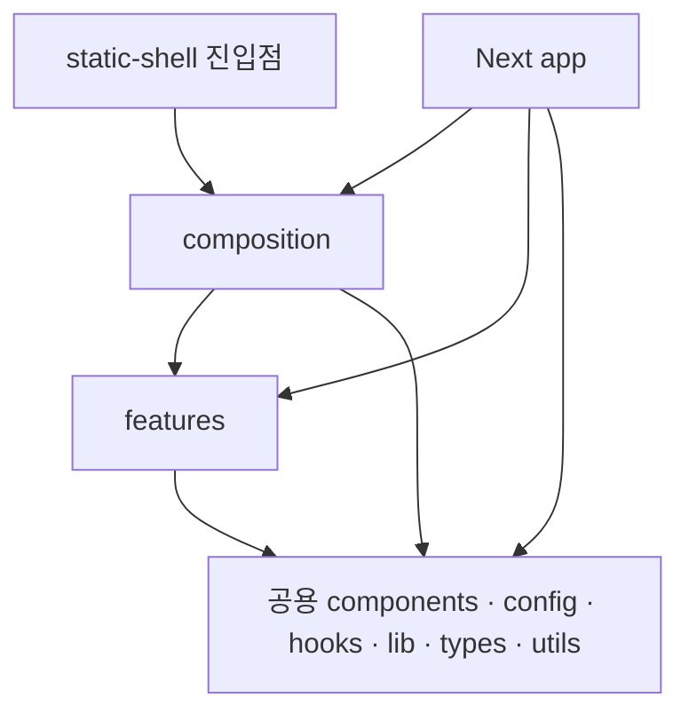

# Angmoo Frontend Architecture

Angmoo의 프론트엔드는 **기능별 코드와 공용 코드를 구분하고, 여러 기능을 화면에서 조립하는 구조**를 사용한다. Chat을 고칠 때는 Chat 기능을, 여러 화면의 공통 버튼을 고칠 때는 공용 컴포넌트를 찾을 수 있도록 책임을 나누는 것이 목적이다.

이 문서는 [Bulletproof React의 Next.js App Router 예제](https://github.com/alan2207/bulletproof-react/tree/master/apps/nextjs-app)에 기반한 **구조 전환의 목표 기준**이다. 2026-09-05 AR-0 기준선과 AR-1 검사 지원을 병합했고, `device-home`을 AR-F1 첫 제품 파일럿으로 옮겨 해당 범위의 새 경계 검사를 활성화했다. Home의 기능 코드는 `features/device-home`, 인증·runtime·Phone shell 조립은 `composition/screens/device-home-screen.tsx`, 공용 구현은 `components/hooks/lib/utils`가 소유한다. 다른 화면에는 `ui`, `model`, `public.ts`, `shared`가 남아 있으므로 [보존 지도](../docs/architecture/refactor-feature-preservation.md)와 [전환 중인 코드 읽기](#전환-중인-코드-읽기)를 함께 확인한다.

## 목차

- [프로젝트 구조](#프로젝트-구조)
- [기능 안에서 코드 나누기](#기능-안에서-코드-나누기)
- [화면 조립과 의존 방향](#화면-조립과-의존-방향)
- [웹과 설치 앱에서 같은 화면 사용하기](#웹과-설치-앱에서-같은-화면-사용하기)
- [API와 상태의 소유권](#api와-상태의-소유권)
- [공용 UI와 디자인](#공용-ui와-디자인)
- [테스트 지원과 실행 위치](#테스트-지원과-실행-위치)
- [기능 추가와 버그 수정](#기능-추가와-버그-수정)
- [전환 중인 코드 읽기](#전환-중인-코드-읽기)
- [개발과 검증](#개발과-검증)
- [설계 근거와 관련 문서](#설계-근거와-관련-문서)

## 프로젝트 구조

아래는 목표 배치다. 생략한 기능과 기존 실행·빌드 파일도 실제 소유권에 따라 유지한다. 모든 폴더를 빈 상태로 미리 만드는 구조는 아니다.

```text
angmoo/
├── frontend/
│   ├── public/                     # 정적 이미지·아이콘 등
│   ├── src/
│   │   ├── app/                    # Next.js route·layout·metadata·웹 진입점
│   │   ├── composition/            # 여러 기능의 화면 조립
│   │   │   ├── screens/            # 웹·정적 실행이 공유하는 화면
│   │   │   └── static-product-router.tsx
│   │   ├── features/
│   │   │   ├── device-home/
│   │   │   ├── characters/
│   │   │   ├── creator-studio/
│   │   │   ├── social/
│   │   │   ├── relationships/
│   │   │   ├── world-packages/
│   │   │   ├── chat/
│   │   │   ├── memory/
│   │   │   └── ...
│   │   ├── components/             # 제품 중립적인 공용 UI
│   │   ├── config/                 # 환경·실행 환경 설정
│   │   ├── hooks/                  # 공용 React hook
│   │   ├── lib/                    # 공용 통신·탐색·데스크톱 연결
│   │   ├── styles/                 # 필요한 공통 스타일
│   │   ├── testing/                # 실제 소비자가 있는 공통 테스트 지원
│   │   │   ├── mocks/
│   │   │   ├── data-generators.ts
│   │   │   ├── test-utils.tsx
│   │   │   └── setup-tests.ts
│   │   ├── types/                  # 여러 기능이 공유하는 타입
│   │   └── utils/                  # 공용 순수 보조 함수
│   ├── static-shell/               # 설치 앱용 정적 Next 앱 진입점·설정
│   ├── scripts/                    # 정적 빌드·preview·Node 검증
│   ├── ARCHITECTURE.md
│   ├── DESIGN.md
│   ├── AGENTS.md
│   ├── package.json
│   ├── pnpm-lock.yaml
│   ├── next.config.ts
│   ├── tsconfig.json
│   └── eslint.config.mjs
├── browser-tests/                  # Playwright 시나리오·설정·브라우저 fixture
└── desktop/                        # Tauri 창·native bridge·설치 앱 지원
```

`app`은 URL과 Next.js에 관한 책임을 가진다. `composition`은 Chat과 Memory처럼 서로 다른 기능을 한 화면에 연결한다. `features`는 각 기능의 화면·데이터 요청·상태를 소유한다. 공용 영역에는 World나 Character 같은 특정 업무를 알아야만 동작하는 코드를 모으지 않는다.

예를 들어 클릭 가능한 기본 버튼은 `components`에 속한다. 그 버튼을 눌러 기억을 삭제하고 결과를 갱신하는 부분은 `features/memory`에 속한다. 기억 삭제 권한과 저장소의 삭제 규칙은 [백엔드](../backend/ARCHITECTURE.md)의 책임이다.

파일명은 `world-chat.tsx`, `memory-batch-controls.tsx`처럼 역할을 드러내는 이름을 사용한다. 같은 이름의 거대한 공용 `helpers` 파일로 여러 기능을 합치지 않는다.

## 기능 안에서 코드 나누기

한 기능의 크기와 실제 역할에 따라 다음 구성을 사용한다. 아래 Chat 트리는 역할 예시이며 모든 파일이 현재 존재한다는 뜻은 아니다.

```text
features/chat/
├── api/                 # Chat endpoint·요청·응답 처리·stream 해석
├── components/          # 채팅 화면·메시지 목록·입력창
├── hooks/               # 채팅 화면의 상태와 요청 생명주기
├── types/               # Chat의 요청·응답·화면 계약
├── utils/               # Chat에서만 쓰는 순수 변환
├── stores/              # 실제로 별도 상태 저장소가 필요할 때
└── __tests__/           # 실행기에 연결된 기능 테스트가 있을 때
```

| 위치 | 담는 내용 | 다른 곳이 담당하는 내용 |
| --- | --- | --- |
| `api` | endpoint, 요청 직렬화, 응답 확인, 기능별 오류와 streaming event 해석 | 실제 화면 배치, 공통 세션·실행 환경 해석 |
| `components` | 사용자에게 보이는 화면, 입력, 이벤트 연결 | 권한 확정, scheduler·provider 실행 정책 |
| `hooks` | loading·선택 상태·요청 취소·구독 해제 등 React 생명주기 | React와 무관한 순수 변환 |
| `types` | 해당 기능이 사용하는 DTO와 컴포넌트 계약 | 관련 없는 기능들의 모든 타입 |
| `utils` | 같은 입력에 같은 결과를 내는 보조 함수 | 숨은 API 호출·저장·권한 변경 |
| `stores` | 실제 여러 소비자가 공유해야 하는 클라이언트 상태 | 서버 상태의 별도 원본이나 불필요한 전역 상태 |

작은 기능은 `api`, `components`, `types`만으로도 충분하다. 로컬 선택 상태 때문에 저장소 라이브러리를 추가할 필요는 없다. 코드가 커지면 같은 역할 안에서 파일을 나누며, 모든 기능에 새로운 추상 계층을 반복해서 만들지 않는다.

예를 들어 기억 예약 설정의 라벨을 바꾸는 작업은 `features/memory/components`에서 시작한다. 요청 payload가 틀렸다면 같은 기능의 `api`와 `types`를 살펴본다. 예약 작업을 언제 실행할지는 프론트엔드 hook이 결정하지 않는다.

## 화면 조립과 의존 방향

다음 화살표는 import할 수 있는 방향을 나타낸다. 공용 영역은 기능을 모르고, 각 기능은 자신을 사용하는 화면을 모른다.



서로 다른 feature끼리는 직접 import하지 않는다. `import type`도 같은 경계에 포함된다. 둘을 함께 사용하는 화면이 각각을 import하고 props·callback·slot으로 연결한다. 기능 하나가 다른 기능의 내부 상태를 직접 읽으면 작은 변경도 두 기능을 함께 고쳐야 하기 때문이다.

아래 코드는 **Chat에서 선택한 근거를 Memory inspector로 전달하는 목표 연결 예시**다. 컴포넌트명과 props는 설명용이며, 실제 적용 시 기존 UI 계약에 맞춘다. `WorldChat`은 Memory 컴포넌트를 import하지 않고 선택 이벤트만 전달한다.

```tsx
// composition/screens/world-chat-screen.tsx — 개념 예시
"use client";

import { useState } from "react";
import { WorldChat } from "@/features/chat/components/world-chat";
import { WorldChatEvidenceInspector } from
  "@/features/memory/components/world-chat-evidence-inspector";

type Scope = { worldId: string; worldCharacterId: string };

export function WorldChatScreen(scope: Scope) {
  return <ChatContent key={`${scope.worldId}:${scope.worldCharacterId}`} {...scope} />;
}

function ChatContent(scope: Scope) {
  const [evidenceId, setEvidenceId] = useState<string | null>(null);

  return (
    <>
      <WorldChat {...scope} onInspectEvidence={setEvidenceId} />
      {evidenceId !== null && (
        <WorldChatEvidenceInspector
          {...scope}
          evidenceId={evidenceId}
          onClose={() => setEvidenceId(null)}
        />
      )}
    </>
  );
}
```

`key`는 World·Character가 바뀔 때 이 예시의 선택 상태를 초기화한다. 실제 데이터 요청도 scope별로 구분하고 이전 요청의 늦은 응답을 현재 화면에 적용하지 않아야 한다. 이 UI 처리와 서버의 권한·scope 검사는 서로 다른 책임이다.

목표 구조에서는 feature의 실제 파일을 직접 import한다. `public.ts`나 전체 export용 `index.ts`를 필수 경유점으로 만들지 않는다. 예를 들어 화면은 `@/features/chat/components/world-chat`을 사용할 수 있다. 반대로 `features/chat`에서 `features/memory`나 `composition`을 가져오는 연결은 만들지 않는다.

공용 `types`로 업무 타입을 옮겨 import 검사만 통과시키지도 않는다. 여러 기능이 실제로 공유하는 계약인지, 조립 화면이 한 기능의 출력을 다른 기능의 입력으로 바꿔 주면 되는지에 따라 위치를 정한다.

## 웹과 설치 앱에서 같은 화면 사용하기

Angmoo에는 Next.js 웹 실행과 설치 앱의 정적 실행이 있다. Tauri 개발 화면은 Next dev 서버를 사용할 수 있으므로, 모든 Tauri 실행을 정적 빌드라고 부르지는 않는다.

| 실행 경로 | 실제 구성 | 화면 코드가 주의할 점 |
| --- | --- | --- |
| Docker·브라우저 | 공식 개발 환경의 Next dev, 웹 배포의 Next 서버 | URL·layout·웹 전용 서버 처리는 `app`이 연결 |
| Windows Host Tauri 개발 | 공식 wrapper가 Docker 개발 환경을 재사용하고 native 창을 연결 | 설치 앱 sidecar를 별도로 시작하지 않음 |
| 설치된 Tauri 앱·정적 preview | 앱에 포함된 HTML/CSS/JS와 클라이언트 라우터 | 요청 시 Next 서버가 실행된다고 가정하지 않음 |

현재 [웹 설정](next.config.ts)은 `output: "standalone"`, 별도 [static-shell 설정](static-shell/next.config.ts)은 `output: "export"`다. [정적 빌드 스크립트](scripts/build-static.mjs)가 static-shell을 빌드해 `frontend/out`으로 옮기고 동적 URL용 HTML fallback을 준비한다. 이 구조를 전체 Next 앱의 export 설정 하나로 대체하지 않는다.

`composition/screens`는 두 진입점에서 사용하는 화면을 모은다. `composition`이라는 이름은 Tauri의 필수 규칙이 아니라, Angmoo가 화면 중복과 Next route 파일에 대한 역참조를 줄이기 위해 선택한 배치다. Next route는 공통 screen을 호출하고, 정적 라우터도 같은 screen을 호출한다.

Next.js의 `page.tsx`, `layout.tsx`, metadata와 요청 시 서버에서 처리할 코드는 `app`에 둔다. 상태·이벤트·브라우저 API가 필요한 컴포넌트는 적절한 Client Component 경계를 가진다. `"use client"`를 붙여도 module 최상위의 `window` 접근이 안전해지는 것은 아니므로 브라우저 전용 접근은 실제 실행 시점과 연결한다. [Next.js의 서버·클라이언트 경계](https://nextjs.org/docs/app/getting-started/server-and-client-components)

정적 export에서도 Server Component는 빌드 시 실행될 수 있다. 제한되는 것은 설치된 앱의 요청마다 필요한 Next 서버 동작이다. 공통 screen에 `next/headers`, 서버 비밀, Node 파일시스템, 요청 시 Server Action에 의존하는 흐름을 넣지 않는다. 기능이 서버 작업을 필요로 하면 기존 FastAPI API와 공용 transport를 통해 연결한다. [Next.js 정적 export](https://nextjs.org/docs/app/guides/static-exports)

새 화면은 정적 라우터의 직접 진입·새로고침·뒤로 가기·미지원 경로도 함께 다룬다. API 주소, 세션, media URL, Tauri capability와 native 명령은 공용 연결 코드에서 해석하고 컴포넌트마다 별도로 추정하지 않는다.

## API와 상태의 소유권

기능별 `api`는 무엇을 요청하는지 알고, 공용 `lib`의 transport는 어느 실행 환경에서 어떻게 전송하는지 안다. 같은 요청을 웹용·설치 앱용으로 두 번 구현하지 않는다.

```text
화면 이벤트
  → 기능 component/hook
  → 기능 api와 types
  → 공용 transport
  → FastAPI의 소유 도메인
  → 응답·오류·stream을 기능 상태로 반영
```

현재 [World Chat client](src/features/chat/api/world-chat-client.ts)는 기능별 응답과 World scope를 확인하고 공용 runtime transport를 사용한다. 이동할 때도 URL·method·오류·NDJSON event·request ID·재시도 의미를 유지한다. 목표의 공용 transport 위치로 옮긴다는 이유로 세션·CSRF 처리를 새 `fetch` 코드로 우회하지 않는다.

서버에서 받은 데이터, UI 선택 상태, 저장되는 사용자 설정을 구분한다. 접힌 패널이나 입력 중인 텍스트는 가까운 컴포넌트가 소유할 수 있다. World·Character·thread에 속한 데이터와 요청은 해당 scope를 유지한다. 저장 설정은 기존 API를 통해 변경하고 응답을 기준으로 화면을 갱신한다.

loading, empty, forbidden, not found, degraded, error는 서로 다른 상태다. 실패한 요청을 빈 배열이나 숫자 0으로 바꿔 성공처럼 표시하지 않는다. 버튼을 숨기는 UI는 편의를 제공하지만 권한을 확정하지 않는다. 기억 삭제·공개 범위·provider 비용 동의 등은 백엔드에서도 검증한다.

응답이 늦게 도착하는 경우도 상태의 일부다. World 전환·unmount 시 취소와 구독 해제를 연결하고, 취소 후에도 도착할 수 있는 결과는 현재 scope·request와 비교한다. hook 이동 중 중복 요청·중복 event 구독·추가 provider 실행이 생기지 않는지 기존 동작과 비교한다.

## 공용 UI와 디자인

[DESIGN.md](DESIGN.md)는 색상·간격·타이포그래피·접근성·상태 표현의 기준이고, 이 문서는 코드의 위치와 연결을 설명한다. 두 문서는 역할이 다르다.

공용 `components`에는 버튼·dialog·표면·제품 중립 layout처럼 여러 기능이 사용할 표현을 둔다. World 전환 시 어떤 기능을 보여 줄지, 누가 기억을 수정할 수 있는지, 어떤 native 창을 열지는 공용 primitive의 판단이 아니다. 해당 feature나 상위 화면이 결정한 값과 callback을 전달한다.

CSS module은 소유 컴포넌트와 함께 이동한다. 공통 스타일은 기존 semantic token을 사용하며, 폴더 정리 때문에 색상이나 화면을 다시 설계하지 않는다. Phone·Studio·Graph의 창 종류, safe-area, scroll 소유권, focus·keyboard 동작도 기존 제품 계약에 포함된다.

`public`의 이미지·아이콘, 정적 빌드 자산 복사, 로컬 font와 디자인 fixture 역시 기능의 소비자다. 소스 import만 바꾸고 asset 경로·visual harness를 남겨두면 웹 또는 설치 앱 한쪽에서만 깨질 수 있다.

## 테스트 지원과 실행 위치

`src/testing`은 여러 테스트가 재사용하는 도구의 위치다. 실제 테스트를 모두 이곳으로 이동하거나 새로운 실행기를 자동 도입하는 뜻은 아니다.

| 위치 | 책임 |
| --- | --- |
| 기능 옆의 테스트·`__tests__` | 해당 기능의 테스트와 그 기능에서만 사용하는 fixture. 실제 실행기에 연결되어 있을 때 사용 |
| `src/testing/data-generators.ts` | 여러 테스트가 사용하는 합성 데이터 생성 |
| `src/testing/mocks` | 재사용하는 통신·플랫폼 대역 |
| `src/testing/test-utils.tsx` | 필요할 때 공통 렌더링·provider 도우미 |
| `src/testing/setup-tests.ts` | 실제 실행기의 설정에 등록한 초기화·정리 |
| `../browser-tests` | 현재 Playwright의 웹·정적·시각 시나리오, 서버·브라우저 전용 fixture |
| `scripts/test-world-package-proxy.mjs` | 현재 Node 기반 프록시 계약 검증 |

작성 시점의 [frontend 의존성](package.json)에는 Vitest·React Testing Library·MSW가 없고 `frontend/e2e`에도 추적된 테스트가 없다. 빈 폴더나 helper 파일이 있다는 이유로 테스트가 실행된다고 판단하지 않는다. 새 도구가 필요한 경우 실제 소비 테스트·설정·명령·CI를 함께 정의한다. 참고 예제의 라이브러리 목록을 그대로 설치하지 않는다.

AR-F1에서도 `src/testing`은 만들지 않았다. Device Home의 공용 검증 소비자는 현재 backend의 소스 계약 테스트, `browser-tests`의 Playwright fixture, frontend의 Node proxy 검사에 이미 연결되어 있다. 여러 기능 테스트가 같은 React 렌더링 helper나 mock server를 실제로 재사용하게 될 때 실행기 등록과 함께 도입한다.

Playwright의 `Page`·`Route`나 Node 서버에 종속된 fixture는 해당 실행 프로젝트에 둔다. 공통화할 수 있는 합성 데이터와 실행기 전용 helper를 구분한다. mock·타이머·구독·공유 상태는 테스트 사이에 정리되어야 한다.

제품의 `app`, `composition`, `features`, 공용 코드는 테스트 전용 지원을 import하지 않는다. 테스트와 지원 코드가 검증 대상이나 provider를 참조하는 방향은 가능하며, 목표 검사기는 그 범위를 제품 코드와 구분한다. 테스트 편의를 위한 경로가 제품 bundle이나 feature 간 우회 연결로 남아서는 안 된다.

기존 `ui-foundation`은 route와 visual harness에 연결된 화면 fixture다. 공통 테스트 helper라고 가정해 `testing`으로 이동하지 않고, 기존 noindex·제품 탐색 비노출·시각 검증 계약을 함께 유지한다.

## 기능 추가와 버그 수정

수정 위치는 화면 이름과 문제의 종류로 찾는다. 아래는 목표 위치이며 현재 경로는 다음 절의 이동표와 함께 확인한다.

| 변경·증상 | 먼저 확인할 위치 | 함께 확인할 계약 |
| --- | --- | --- |
| 기억 예약 설정의 라벨·입력·오류 표시 | `features/memory/components`, 관련 `api/types` | 기존 동의·scope·실패 상태와 실제 응답 |
| Chat과 Memory inspector의 선택 연결 | `composition/screens`와 각 기능의 callback | 다른 World의 선택·응답이 남지 않는지 |
| 채팅이 두 번 전송되거나 stream이 남음 | Chat hook·API·공용 transport의 구독/취소 경로 | request ID·재시도·NDJSON·backend 상태 |
| 여러 화면의 dialog focus가 어긋남 | 공용 `components`와 DESIGN | 기능별 동작과 keyboard·scroll |
| 웹은 열리는데 설치 앱의 직접 URL 진입이 실패 | 정적 라우터·공용 탐색·static-shell | 경로 해석·fallback·지원 capability |
| API가 권한 오류를 반환 | 기능 API의 오류 처리와 백엔드 소유 도메인 | UI에서 우회하지 않고 실제 scope·권한 확인 |

예를 들어 기존 Memory 화면에 저장된 예약 상태를 표시하는 작업이라면 다음 흐름으로 이해할 수 있다.

1. 백엔드가 이미 제공하는 응답과 오류를 확인하고 해당 기능의 타입·API에 연결한다.
2. Memory 컴포넌트가 loading·없음·실패·저장 상태를 표현한다. 서버 값을 추정한 가짜 상태는 만들지 않는다.
3. 다른 기능의 화면에도 필요하면 상위 screen에서 Memory 표현을 조립한다. 두 feature가 서로 import하지 않는다.
4. 기존 브라우저 fixture의 응답과 assertion을 사용해 화면 상태를 비교하고, 공통 screen이라면 정적 실행도 확인한다.

백엔드 응답이나 기능 의미의 변경이 필요한 경우에는 [백엔드 아키텍처](../backend/ARCHITECTURE.md)와 해당 기능 계약도 함께 검토한다. UI 구조 이동만으로 API나 사용자 동작을 바꾸지는 않는다.

## 전환 중인 코드 읽기

현재 checkout과 목표 구조가 같지는 않다. 다음 대응표는 기존 기능을 찾는 출발점이다.

| 현재 경로·형태 | 목표 위치·의미 |
| --- | --- |
| `features/*/ui` | 같은 기능의 `components`. CSS module도 소유 컴포넌트와 함께 이동 |
| `features/*/model` | 내용에 따라 `types`, `utils`, `hooks`, 필요한 `stores` |
| `features/*/public.ts` | 실제 파일 import로 소비자를 전환한 뒤 불필요한 facade 제거 |
| `shared/ui` | 공용 `components` 등 제품 중립 표현 |
| `shared/auth`, `shared/runtime`, `shared/navigation`, `shared/desktop` | 공용 transport·세션 연결·중립 helper는 `lib/hooks/utils`; 제품별 판단은 기능 또는 조립 영역 |
| 최상위 `components`, `lib`의 업무 코드 | 실제 소유 feature의 `components/api/types` 등 |
| 여러 기능을 묶는 `device-shell`, `world-app`, `pwa-shell`의 코드 | 조립은 `composition`, 독립 기능·중립 표현은 실제 책임별 배치 |
| `app/*-route-client`를 정적 router가 import하는 연결 | 공통 screen을 `composition/screens`로 옮기고 두 진입점이 사용 |

현재 [frontend AGENTS](AGENTS.md), [product-shell 계약](../docs/architecture/frontend-product-shell.md), [경계 정책](../security/frontend_architecture_policy.json)은 전환된 `device-home`과 미전환 `public.ts`·`shared` 경로를 함께 설명한다. Device Home의 `public.ts`는 Creator Studio·Memory·World App의 네 소비자만 위한 한시적 API/type/presentation facade이며 screen이나 shell을 export하지 않는다. 공용 옛 경로는 새 canonical 구현을 가리키는 명시적 re-export만 남기고 AR-F4에서 소비자를 옮긴 뒤 제거한다. 미전환 영역은 기존 규칙을 유지하고, 전환하는 영역은 코드·소비자·정책·설명을 같은 변경에서 맞춘다.

정상적인 목표 import와 금지된 역참조를 검사할 수 있어야 한다. 광범위한 예외나 검사 비활성화로 경로 변경을 통과시키지 않는다. 문서에 없는 현재 파일도 사용처·테스트·빌드 연결을 확인하며, 필요한 기능을 예시 트리 밖에 있다는 이유로 제거하지 않는다.

## 개발과 검증

환경 설치와 공식 실행 절차는 [CONTRIBUTING.md](../CONTRIBUTING.md)가 소유한다. 공식 기여 환경은 Docker Compose의 Next dev와 FastAPI 두 서비스이며, Windows native 창 확인은 [Host Tauri 개발 안내](../docs/public/windows-host-tauri-dev.md)의 wrapper를 사용한다. 설치형 sidecar 실행과 개발용 Docker backend를 섞지 않는다.

저장소 root에서 공식 개발 환경의 프론트엔드 검사는 다음과 같이 실행한다.

```powershell
docker compose -f compose.yml -f compose.dev.yml exec -T frontend pnpm lint
docker compose -f compose.yml -f compose.dev.yml exec -T frontend pnpm typecheck
docker compose -f compose.yml -f compose.dev.yml exec -T frontend pnpm build
```

저장소에 맞는 도구·의존성이 설치된 호스트에서는 다음 명령도 사용한다. 코드 이동에 맞는 항목을 선택하며, 모든 작은 변경마다 전체 실행 경로를 반복하는 것은 아니다.

```powershell
pnpm --dir frontend lint
pnpm --dir frontend typecheck
pnpm --dir frontend test:world-package-proxy
pnpm --dir frontend build
pnpm --dir frontend build:static

uv run --project backend python scripts/ci/check_frontend_architecture_boundaries.py
uv run --project backend python scripts/ci/check_frontend_design_contract.py --check
```

브라우저 테스트는 [실제 설정과 명령](../browser-tests/package.json)별로 수집 범위가 다르다. 의존성·Playwright Chromium 설치는 기여 안내를 따른다.

| 명령 — 저장소 root 기준 | 범위·전제 |
| --- | --- |
| `pnpm --dir browser-tests test` | `product-shell.spec.ts` 패턴에 맞는 웹 셸·관계 그래프 시나리오. 모든 브라우저 검증을 한 번에 실행하는 명령은 아님 |
| `pnpm --dir browser-tests test:ui-e-local-settings` | 별도 local-settings 설정의 시나리오 |
| `pnpm --dir browser-tests exec playwright test --config playwright.static.config.ts` | 정적 시나리오. 먼저 `frontend build:static` 필요 |
| `pnpm --dir browser-tests test:visual` | 시각 설정의 Next·정적 프로젝트. 두 빌드와 CI의 고정 이미지·font 기준 확인 |

새 `src/testing` 지원 코드가 생기면 실제 소비 테스트·수집 설정·초기화와 CI 실행을 연결한다. 폴더 이동 후 테스트 수가 같다는 것만으로 assertion과 제품 동작이 보존됐다고 판단하지 않는다. 웹 build가 성공해도 정적 라우팅·native 창·설치 앱의 검증까지 대신하지는 않는다.

구조를 옮기는 변경은 API·상태·화면·asset·테스트의 이전 경로와 새 경로를 함께 설명한다. 기능별 회귀는 합성 데이터와 대역으로 확인하며, 실제 provider 품질이나 설치 앱 사용자 확인은 해당 검증 결과로 별도 기록한다.

## 설계 근거와 관련 문서

Bulletproof React에서 채택한 것은 기능별 구성, 공용 코드 분리, 상위 화면 조립, 직접 파일 import와 필요한 폴더만 사용하는 방식이다. Angmoo는 여기에 웹·정적 실행을 위한 `composition`, 기존 `browser-tests`, Tauri 연결을 추가한다. Yarn·React Query·Zustand·Vitest 등 예제의 도구 선택을 구조의 필수 조건으로 가져오지 않는다.

- [Bulletproof React — Project Structure](https://github.com/alan2207/bulletproof-react/blob/master/docs/project-structure.md): 역할 배치와 의존 방향.
- [Next.js App Router 예제](https://github.com/alan2207/bulletproof-react/tree/master/apps/nextjs-app), [공통 테스트 지원 예제](https://github.com/alan2207/bulletproof-react/tree/master/apps/nextjs-app/src/testing): 실제 디렉터리와 사용 사례.
- [FastAPI Best Practices README](https://github.com/zhanymkanov/fastapi-best-practices/blob/master/README.md): 역할·이유·짧은 예시로 설명하는 전달 방식 참고. 프론트엔드 설계의 기준으로 그 내용을 복사하지 않음.
- [DESIGN.md](DESIGN.md), [디자인 참고 근거](../docs/architecture/frontend-design-reference.md): 사용자 화면의 시각·상호작용 기준.
- [기여 위치 안내](../docs/public/contribution-map.md), [현재 제품 구조](../docs/public/architecture.md): 기존 기능과 개발 환경 탐색.
- [Today SNS 계약](../docs/architecture/p8-l-r-today-sns-activity.md), [Memory batch 계약](../docs/architecture/p8-l-r-memory-batch.md): 구조 이동 중 보존할 기능 의미.

설계의 작업공간 원본은 `docs/plan/09-04 Angmoo 구조 리팩터링 — 기능 보존·Bulletproof React·FastAPI 도메인 중심 전환 계획.md`다. 공개 저장소 밖의 계획 파일을 가지고 있지 않아도 이 문서와 위 저장소 내부 링크로 구조를 이해할 수 있다. 코드 이동 순서와 작업별 완료 상태는 실행계획에서 관리하며, 이 문서는 변경 위치·역할·연결의 기준을 설명한다.
